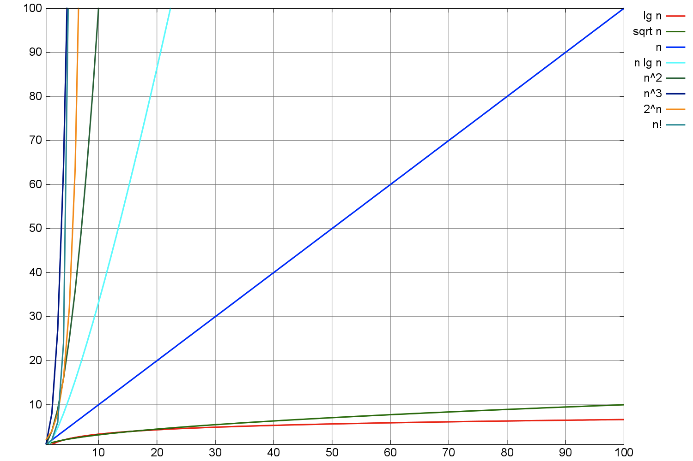
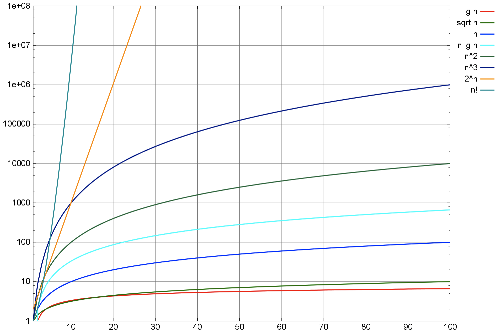
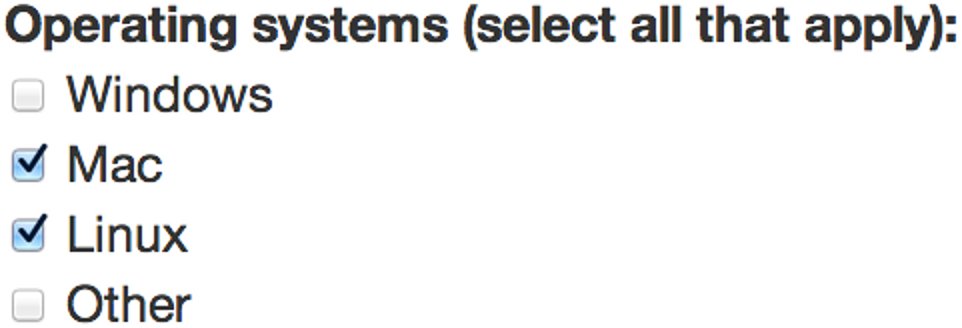
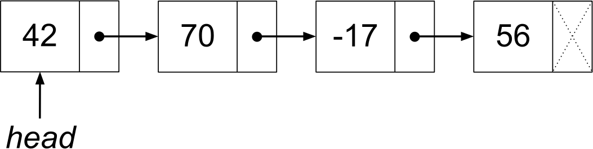
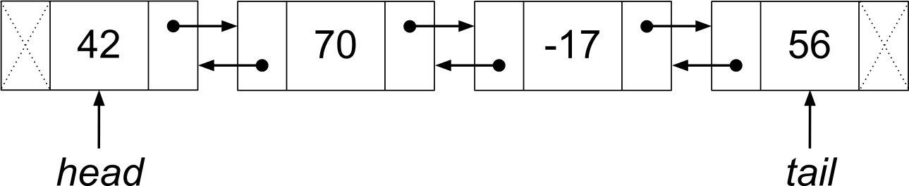
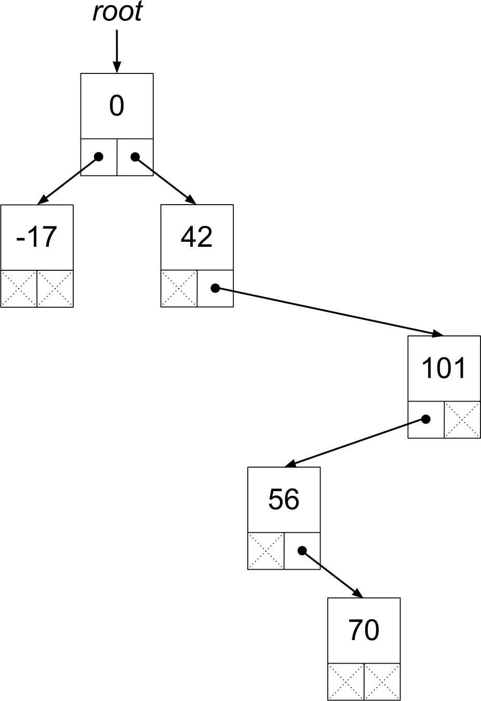
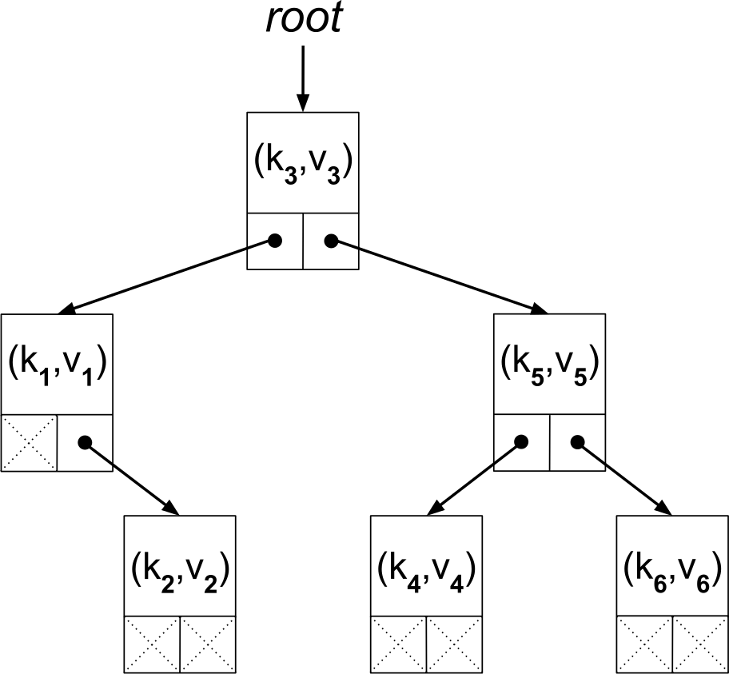
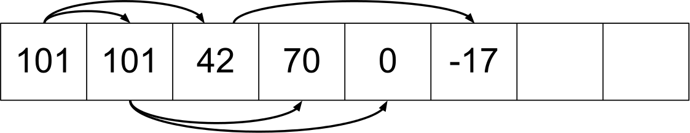
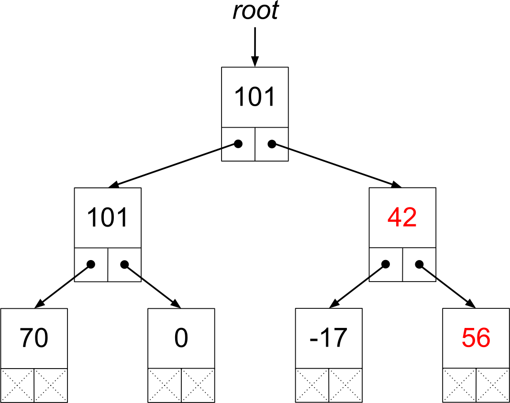
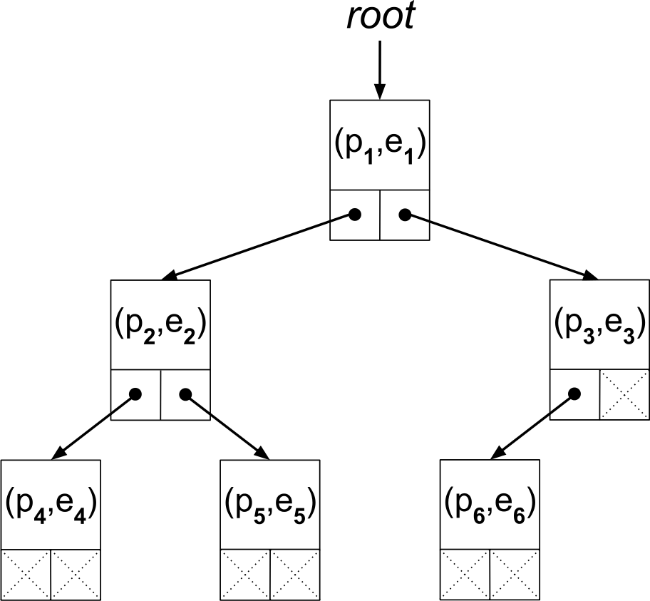

{#chapter-data-structures-and-algorithms}
# Data Structures and Algorithms

Classes on data structures and algorithms can be overwhelming. There are so many things to learn! Constructing a minimum spanning tree or computing a convex hull is only the tip of the iceberg. But unless your work is highly specialized, you will not need many of these data structures and algorithms. Instead, you will repeatedly use only a small handful of them. Now you may think that if you only need to know a handful of data structures and algorithms, then you can get by without knowing any. But that is not true. Having a comprehensive understanding of the fundamental data structures and algorithms not only makes your code more robust, such as running faster and consuming less memory, but more correct. These are the hallmarks of any well-designed program.

This chapter covers such fundamentals. It starts on mathematical grounds, where we develop mathematical concepts that allow us to inspect any code and determine its efficiency. We then move on to less theoretical matters, namely important abstract data types and data structures. We close by looking at important algorithms related to randomness, searching, and sorting.

## Rates of growth

While multiple algorithms almost undoubtedly exist to solve a given problem, we usually prefer to use the algorithm that is most *efficient*. Such an algorithm will execute faster or use less memory than the alternatives. We therefore need a robust framework for quantifying these properties of algorithms, so that we can make sound comparisons between them.

Given the wide array of hardware and runtime environments in use, we cannot effectively quantify memory usage as bytes consumed, or execution speed as seconds elapsed. For example, consider an array of one million `long` integers in a C program. It uses 4 MB of memory on a 32-bit machine, where each value is 4 bytes, and 8 MB of memory on a 64-bit machine, where each value is 8 bytes. Whether this jump in memory usage is consequential depends on whether the program runs on a high-end server or an embedded device. The high-end server can also execute orders of magnitude more [instructions per second](https://en.wikipedia.org/wiki/Instructions_per_second) than an embedded device. And specialized components like GPUs or [ASICs](https://en.wikipedia.org/wiki/Application-specific_integrated_circuit) can perform certain operations very quickly as opposed to all operations at a reasonable speed.

But regardless of the underlying hardware or environment, we can always express the memory usage or execution speed of an algorithm as a function of the size of its input. Such a function is characterized by a *rate of growth*, or how the output responds when the input becomes large. Comparing such rates of growth is the basis for comparing algorithms.

### Linear growth

Consider the following method in C that computes the average of an array containing {$$}n{/$$} integers:

{lang=c}
~~~
#include <stdio.h>

double average(int* array, int n) {
  double sum = 0;
  for (int i = 0; i < n; ++i) {
    sum += array[i];
  }
  return (sum / n);
}
~~~

Regardless of how long this method takes to run on an array containing one million integers, we can intuit that it takes approximately twice as long to run on an array containing two million integers, or 10 times as long to run on an array containing 10 million integers. With a few assumptions and a little math, we can reason why:

* Let executing `sum = 0` and `i = 0` take {$$}t_{1}{/$$} seconds.
* Let executing `i < n`, `sum += array[i]`, and `++i` on each of the {$$}n{/$$} iterations take {$$}t_{2}{/$$} seconds.
* Let executing `sum / n` take {$$}t_{3}{/$$} seconds.

The function {$$}f(n) = t_{1} + (t_{2} \cdot n) + t_{3}{/$$} approximates the time in seconds for method `average` to run. Now it's a good bet that storage capacity, processor speed, and network bandwidth will only continue to increase. Consequently, we should expect that the input size {$$}n{/$$} will also continue to increase, trending toward infinity. Therefore we are especially interested in the output of this function as {$$}n{/$$} becomes very large.

Even if {$$}t_{1}{/$$} and {$$}t_{3}{/$$} are large and {$$}t_{2}{/$$} is small, as {$$}n{/$$} becomes increasingly large, the term {$$}t_{2} \cdot n{/$$} will account for the majority of the sum. In fact, we can always choose a large enough value of {$$}n{/$$} such that this term accounts for 99%, 99.99%, or even 99.99999% of the sum. When this happens, we say that the term {$$}t_{2} \cdot n{/$$} *dominates* the running time of `average`. We can then ignore the remaining terms {$$}t_{1}{/$$} and {$$}t_{3}{/$$} because their values are insignificant by comparison. Rewriting {$$}f(n){/$$} as {$$}f(n) \simeq t_{2} \cdot n{/$$}, it's clear that increasing {$$}n{/$$} by a factor of {$$}k{/$$} also increases the running time of `average` by a factor of {$$}k{/$$}. This supports our earlier intuition.

Now say that we build on this C code to compute the [standard deviation](https://en.wikipedia.org/wiki/Standard_deviation) of an array of numbers:

{lang=c}
~~~
#include <math.h>
#include <stdio.h>

double stddev(long* array, int n) {
  // First pass to compute the average.
  double sum = 0;
  for (int i = 0; i < n; ++i) {
    sum += array[i];
  }
  double mean = sum / n;
  // Second pass to compute the sum of squared differences.
  double squared_diff_sum = 0;
  for (int j = 0; j < n; ++j) {
    double diff = array[j] - mean;
    squared_diff_sum += (diff * diff);
  }
  // Standard deviation is the square root of the variance.
  double variance = squared_diff_sum / n;
  return sqrt(variance);
}
~~~

Let's continue our analysis of the running time:

* Let executing `squared_diff_sum = 0` and `j = 0` take {$$}t_{4}{/$$} seconds.
* Let executing `j < n`, `diff = array[j] - mean`, `squared_diff_sum += (diff * diff)`, and `++j` on each of the {$$}n{/$$} iterations take {$$}t_{5}{/$$} seconds.
* Let executing `variance = squared_diff_sum / n` and `sqrt(variance)` take {$$}t_{6}{/$$} seconds.

The function {$$}f(n) = t_{1} + (t_{2} \cdot n) + t_{3} + t_{4} + (t_{5} \cdot n) + t_{6}{/$$} approximates the time in seconds for method `stddev` to run. We can rewrite this sum as {$$}f(n) = t_{1} + t_{3} + t_{4} + t_{6} + (t_{2} + t_{5}) \cdot n{/$$}. As discussed earlier, we can always choose a large enough value of {$$}n{/$$} such that the term {$$}(t_{2} + t_{5}) \cdot n{/$$} dominates the running time of `stddev`. We can then ignore the remaining terms {$$}t_{1}{/$$}, {$$}t_{3}{/$$}, {$$}t_{4}{/$$}, and {$$}t_{6}{/$$} because their values are insignificant by comparison. This lets us rewrite {$$}f(n){/$$} as {$$}f(n) \simeq (t_{2} + t_{5}) \cdot n{/$$}.

Again, regardless of the value of {$$}t_{2}{/$$}, increasing {$$}n{/$$} by a factor of {$$}k{/$$} also increases the output of {$$}f(n) \simeq t_{2} \cdot n{/$$} by a factor of {$$}k{/$$}. Similarly, regardless of the values of {$$}t_{2}{/$$} or {$$}t_{5}{/$$}, increasing {$$}n{/$$} by a factor of {$$}k{/$$} also increases the output of {$$}f(n) \simeq (t_{2} + t_{5}) \cdot n{/$$} by a factor of {$$}k{/$$}. Each function is [a linear function](https://en.wikipedia.org/wiki/Linear_function_(calculus)), and we say that its output *grows linearly* with its input. Both are straight lines when graphed, although the function describing `stddev` has a steeper slope than the function describing `average` since {$$}(t_{2} + t_{5}) > t_{2}{/$$}.

We can write any function demonstrating linear growth as {$$}f(n) \simeq c \cdot n{/$$} for some value {$$}c{/$$}. For the function describing `average`, {$$}c = t_{2}{/$$}. For the function describing `stddev`, {$$}c = t_{2} + t_{5}{/$$}. But reflecting on our analysis of {$$}f(n){/$$} for methods `average` and `stddev`, we can argue that the value of {$$}c{/$$} does not matter:

* Given the wide array of architectures and environments, {$$}t_{2}{/$$} and {$$}t_{5}{/$$} have no fixed value. Therefore {$$}c{/$$} has no fixed value. It is arbitrary.
* The output of {$$}f(n){/$$} scales with the input size {$$}n{/$$}, not with the size of {$$}t_{2}{/$$} or {$$}t_{5}{/$$}. Both functions are linear functions. Their values were irrelevant when deciding the growth rate of {$$}f(n){/$$}. Therefore {$$}c{/$$} is also irrelevant.

While the input size {$$}n{/$$} may not always be knowable, it is independent of the architecture and environment. It also determines the growth rate of the function. *Big O notation* formalizes these conclusions by generalizing the constant {$$}c{/$$} above as a *hidden constant*. This is because, as we saw, its value is both arbitrary and irrelevant when determining the function's rate of growth. Big O notation classifies the function {$$}f(n) = c \cdot n{/$$} as {$$}O(n){/$$}, pronounced as "O of n." The *O* stands for the *order*, or growth rate, of the function. The {$$}n{/$$} is from the dominating term in the function that describes the rate of growth.

A> For the mathematically inclined, the precise definition of {$$}O(n){/$$} is that {$$}f(n) \in O(n){/$$} if there exists a {$$}c > 0{/$$} and {$$}n_{0}{/$$} such that {$$}f(n) > c \cdot n{/$$} whenever {$$}n > n_{0}{/$$}. If you understood that, then the book *Introduction to Algorithms* or *Algorithms* mentioned at the beginning of this chapter will not daunt you.

### Non-linear growth

The functions describing the running times of many methods, however, do not grow linearly with the input size {$$}n{/$$}. Such a function is *non-linear*, and we say that its output grows *non-linearly*. Increasing the input size {$$}n{/$$} by a factor of {$$}k{/$$} does not increase its output by a factor of {$$}k{/$$}. Instead, the running time can increase by a factor that is smaller or larger than {$$}k{/$$}. The magnitude of the output factor can, in turn, depend on whether {$$}n{/$$} itself is small or large. Again, we turn to big O notation to describe the growth rates of these functions.

Two of the most common growth rates are {$$}\lg n{/$$} and {$$}n \lg n{/$$}:

* {$$}\lg n{/$$} is the *binary logarithm*. It is the same as {$$}log_{2} n{/$$}. If {$$}log_{2} n = y{/$$}, then {$$}2^{y} = n{/$$}, and so {$$}\lg 1,024 = 10{/$$}, {$$}\lg 1,048,576 = 20{/$$}, and so forth. The binary logarithm is ubiquitous in computing. We need {$$}\lg n{/$$} bits to represent the integers {$$}0, 1, \dotsc n - 1{/$$}. Later we will see fundamental data structures that organize data of size {$$}n{/$$} into {$$}\lg n{/$$} levels. An algorithm that accepts an input of size {$$}n{/$$} and eliminates half of the remaining input on every step, like binary search, requires {$$}\lg n{/$$} steps until only one element remains. When each step takes a constant time {$$}t{/$$}, then such an algorithm takes {$$}O(\lg n){/$$} time.
* {$$}n \lg n{/$$}, which is the same as {$$}n \cdot \lg n{/$$}, is the minimum number of comparisons between elements that an algorithm must make in order to completely sort an input of size {$$}n{/$$}. Each comparison takes a constant time {$$}t{/$$}, and so such a sorting algorithm takes {$$}O(n \lg n){/$$} time.

Another common big O running time is {$$}O(1){/$$}. This is called *constant time* because it is independent of the value of {$$}n{/$$}. Hence {$$}O(1){/$$} represents a growth rate of zero, or an absence of growth, in {$$}f(n){/$$} as {$$}n{/$$} increases. Looking back on method `average`, executing `sum = 0`, `i = 0`, and computing `sum / n` are all {$$}O(1){/$$} operations because they do not execute on every iteration of the loop. The terms {$$}t_{1}{/$$} and {$$}t_{3}{/$$} represented them in {$$}f(n){/$$}. Unlike the term {$$}t_{2} \cdot n{/$$}, these terms are independent of {$$}n{/$$}. But as discussed, the running time of method `average` was {$$}O(n){/$$} because the term {$$}t_{2} \cdot n{/$$} dominates as {$$}n{/$$} increases.

A> As mentioned earlier, big O notation generalizes any constant as a hidden constant. A linear function {$$}f(n) = t \cdot n{/$$} simply becomes {$$}O(n){/$$} because {$$}t{/$$} is constant. Similarly, we can rewrite {$$}f(n) = t{/$$} as {$$}f(n) = t \cdot 1{/$$}, which becomes {$$}O(1){/$$} by the same principle.

Some other growth rates include:

* {$$}\sqrt{n}{/$$} is the maximum number of divisions required to naively determine whether a positive integer is prime. If any integer in {$$}2, 3, \dotsc \sqrt{n}{/$$} divides {$$}n{/$$} evenly, then {$$}n{/$$} is not prime.
* {$$}n^{2}{/$$}, which is the same as {$$}n \cdot n{/$$}, is the number of arrows in a graph where each of {$$}n{/$$} nodes has an arrow drawn to itself and to every other node.
* {$$}n^{3}{/$$}, which is the same as {$$}n \cdot n \cdot n{/$$}, is the number of multiplication operations required to multiply together two {$$}n \times n{/$$} matrices. Computing a [dot product](https://en.wikipedia.org/wiki/Dot_product) between a row of {$$}n{/$$} elements in the first matrix and a column of {$$}n{/$$} elements in the second matrix yields one of the {$$}n^{2}{/$$} elements in the resulting matrix.
* {$$}2^{n}{/$$}, which is the same as multiplying {$$}2{/$$} with itself {$$}n{/$$} times, is the number of distinct inputs for a conditional expression that contains {$$}n{/$$} distinct boolean variables. Additionally, it is the number of integers that a sequence of {$$}n{/$$} bits can represent.
* {$$}n!{/$$}, which is the same as {$$}n \cdot (n - 1) \cdot (n - 2) \dotsb 2 \cdot 1{/$$}, is the number of [permutations](https://en.wikipedia.org/wiki/Permutation) that exist for {$$}n{/$$} elements.

### Comparing growth rates

Excluding the function {$$}f(n) = c{/$$}, which is classified as {$$}O(1){/$$}, the following graph compares the values of these functions with the linear function {$$}f(n) = n{/$$}. The input {$$}n{/$$} varies between {$$}1{/$$} and {$$}100{/$$}:

This graph adequately illustrates the growth rates of {$$}\lg n{/$$}, {$$}\sqrt{n}{/$$}, and {$$}n{/$$}, but {$$}n \lg n{/$$}, {$$}n^{2}{/$$}, {$$}n^{3}{/$$}, {$$}2^{n}{/$$}, and {$$}n!{/$$} escape the graph too quickly. For a better perspective of these functions, we can view y axis on a logarithmic scale:

Here we now see the growth of {$$}n \lg n{/$$}, {$$}n^{2}{/$$}, and {$$}n^{3}{/$$}. Note how for {$$}n < 10{/$$}, {$$}n^{3}{/$$} is larger than both {$$}2^{n}{/$$} and {$$}n!{/$$}, but as {$$}n{/$$} increases these two functions grow much faster than {$$}n^{3}{/$$}. Despite the logarithmic scale, {$$}2^{n}{/$$} and {$$}n!{/$$} still escape the graph too quickly. Calculating their values when {$$}n{/$$} is {$$}10^{0} = 1, 10^{1} = 10, \dotsc 10^{5}{/$$}, we can see just how meteoric their rise is:

|{$$}f(n){/$$}    |{$$}f(1){/$$}|{$$}f(10){/$$}|{$$}f(10^2){/$$}|{$$}f(10^3){/$$}|{$$}f(10^4){/$$}|{$$}f(10^5){/$$}|
|-----------------|-------------|--------------|----------------|----------------|----------------|----------------|
|{$$}\lg n{/$$}   |{$$}0{/$$}   |{$$}3.32{/$$} |{$$}6.64{/$$}   |{$$}9.97{/$$}   |{$$}13.3{/$$}   |{$$}16.6{/$$}   |
|{$$}\sqrt{n}{/$$}|{$$}1{/$$}   |{$$}3.16{/$$} |{$$}10{/$$}     |{$$}31.6{/$$}   |{$$}100{/$$}    |{$$}316{/$$}    |
|{$$}n{/$$}       |{$$}1{/$$}   |{$$}10{/$$}   |{$$}10^2{/$$}   |{$$}10^3{/$$}   |{$$}10^4{/$$}   |{$$}10^5{/$$}   |
|{$$}n \lg n{/$$} |{$$}0{/$$}   |{$$}33.2{/$$} |{$$}664{/$$}    |{$$}9.97 \times 10^3{/$$}|{$$}1.33 \times 10^5{/$$}|{$$}1.66 \times 10^6{/$$}|
|{$$}n^2{/$$}     |{$$}1{/$$}   |{$$}100{/$$}  |{$$}10^4{/$$}   |{$$}10^6{/$$}            |{$$}10^8{/$$}            |{$$}10^{10}{/$$}         |
|{$$}n^3{/$$}     |{$$}1{/$$}   |{$$}10^3{/$$} |{$$}10^6{/$$}   |{$$}10^9{/$$}            |{$$}10^{12}{/$$}         |{$$}10^{15}{/$$}         |
|{$$}2^n{/$$}     |{$$}2{/$$}   |{$$}1.02 \times 10^3{/$$}|{$$}1.27 \times 10^{30}{/$$}|{$$}1.07 \times 10^{301}{/$$}|{$$}2.00 \times 10^{3,010}{/$$}|{$$}9.99 \times 10^{30,102}{/$$}|
|{$$}n!{/$$}      |{$$}1{/$$}   |{$$}3.63 \times 10^6{/$$}|{$$}9.33 \times 10^{157}{/$$}|{$$}4.02 \times 10^{2,567}{/$$}|{$$}2.85 \times 10^{35,659}{/$$}|{$$}2.82 \times 10^{456,573}{/$$}|

To understand the implications of the last column, let's assume that for each function {$$}f(n){/$$} above, we have an algorithm with a running time of {$$}t \cdot f(n){/$$}, where {$$}t{/$$} is {$$}1{/$$} microsecond, or {$$}\frac{1}{1,000,000}{/$$} of a second. We then measure the running time of each algorithm to process an array containing {$$}10^{5}{/$$}, or 100,000 elements:

* If {$$}f(n) = \lg n{/$$}, it takes less than {$$}\frac{17}{1,000,000}{/$$} of a second to run.
* If {$$}f(n) = n{/$$}, it takes {$$}\frac{1}{10}{/$$} of a second to run.
* If {$$}f(n) = n \lg n{/$$}, it takes {$$}1.66{/$$} seconds to run.
* If {$$}f(n) = n^2{/$$}, it takes {$$}10^4{/$$} seconds to run, which is over {$$}2{/$$} hours and {$$}45{/$$} minutes.
* If {$$}f(n) = n!{/$$}, it takes {$$}2.82 \times 10^{456,567}{/$$} seconds to run, which is over {$$}8.94 \times 10^{456,559}{/$$} years.

To understand why the running times for {$$}n^2{/$$} and {$$}n!{/$$} are so large, we must again turn to the growth rate of each function. Between two values {$$}n_{1}{/$$} and {$$}n_{0}{/$$}, the average growth rate of a function {$$}f(n){/$$} equals {$$}\frac{f(n_{1}) - f(n_{0})}{n_{1} - n_{0}}{/$$}. When the function is graphed, this is simply the average [slope](https://en.wikipedia.org/wiki/Slope) of the line connecting the points {$$}(n_{0}, f(n_{0})){/$$} and {$$}(n_{1}, f(n_{1})){/$$}. Calculating this average slope between the points where {$$}n{/$$} is {$$}10^{0} = 1, 10^{1} = 10, \dotsc 10^{5}{/$$}:

|{$$}f(n){/$$}    |{$$}\frac{f(10) - f(1)}{10 - 1}{/$$}|{$$}\frac{f(10^2) - f(10)}{10^2 - 10}{/$$}|{$$}\frac{f(10^3) - f(10^2)}{10^3 - 10^2}{/$$}|{$$}\frac{f(10^4) - f(10^3)}{10^4 - 10^3}{/$$}|{$$}\frac{f(10^5) - f(10^4)}{10^5 - 10^4}{/$$}|
|-----------------|--------------|----------------------------|----------------------------|----------------------------|----------------------------|
|{$$}\lg n{/$$}   |{$$}0.369{/$$}|{$$}3.69 \times 10^{-2}{/$$}|{$$}3.69 \times 10^{-3}{/$$}|{$$}3.69 \times 10^{-4}{/$$}|{$$}3.69 \times 10^{-5}{/$$}|
|{$$}\sqrt{n}{/$$}|{$$}0.240{/$$}|{$$}7.60 \times 10^{-2}{/$$}|{$$}2.40 \times 10^{-2}{/$$}|{$$}7.60 \times 10^{-3}{/$$}|{$$}2.40 \times 10^{-3}{/$$}|
|{$$}n{/$$}       |{$$}1{/$$}    |{$$}1{/$$}                  |{$$}1{/$$}                  |{$$}1{/$$}                  |{$$}1{/$$}                  |
|{$$}n \lg n{/$$} |{$$}3.69{/$$} |{$$}7.01{/$$}               |{$$}10.3{/$$}               |{$$}13.7{/$$}               |{$$}17.0{/$$}               |
|{$$}n^2{/$$}     |{$$}11{/$$}   |{$$}110{/$$}                |{$$}1.10 \times 10^3{/$$}   |{$$}1.10 \times 10^4{/$$}   |{$$}1.10 \times 10^5{/$$}   |
|{$$}n^3{/$$}     |{$$}111{/$$}  |{$$}1.11 \times 10^4{/$$}   |{$$}1.11 \times 10^6{/$$}   |{$$}1.11 \times 10^8{/$$}   |{$$}1.11 \times 10^{10}{/$$}|
|{$$}2^n{/$$}     |{$$}114{/$$}  |{$$}1.41 \times 10^{28}{/$$}|{$$}1.19 \times 10^{298}{/$$}|{$$}2.22 \times 10^{3,006}{/$$}|{$$}1.11 \times 10^{30,098}{/$$}|
|{$$}n!{/$$}      |{$$}4.03 \times 10^5{/$$}|{$$}1.04 \times 10^{156}{/$$}|{$$}4.47 \times 10^{2,564}{/$$}|{$$}3.16 \times 10^{35,655}{/$$}|{$$}3.14 \times 10^{456,568}{/$$}|

Again, let's assume that {$$}t{/$$} is {$$}\frac{1}{1,000,000}{/$$} of a second, and turn our attention to the last column. Say an array has {$$}10^{4}{/$$}, or 10,000 elements. We append values to it until it has {$$}10^{5}{/$$}, or 100,000 elements. After appending each value to the array, we measure the increase in running time for each algorithm:

* If {$$}f(n) = \lg n{/$$}, appending each element adds less than {$$}\frac{37}{1,000,000,000,000}{/$$} of a second on average.
* If {$$}f(n) = n{/$$}, appending each element always adds {$$}\frac{1}{1,000,000}{/$$} of a second, because of the linear relation.
* If {$$}f(n) = n \lg n{/$$}, appending each element adds {$$}\frac{17}{1,000,000}{/$$} of a second on average.
* If {$$}f(n) = n^2{/$$}, appending each element adds {$$}\frac{11}{100}{/$$} of a second on average.
* If {$$}f(n) = n!{/$$}, appending each element adds {$$}3.14 \times 10^{456,562}{/$$} seconds on average, which is over {$$}9.95 \times 10^{456,554}{/$$} years.

Given how fast {$$}n^2{/$$} and {$$}n!{/$$} grow, it's no surprise that their corresponding algorithms had such long running times given an array of {$$}10^{5}{/$$} elements. In big O notation, algorithms with smaller growth rates are more *asymptotically efficient* than those with larger growth rates. Such asymptotically efficient algorithms run faster or use less memory the input size {$$}n{/$$} increases.

Although the tables above are no substitute for a mathematical proof, they support the fact that as {$$}n{/$$} becomes large, {$$}O(1) < O(\lg n) < O(\sqrt{n}) < O(n) < O(n \lg n) < O(n^2) < O(n^3) < O(2^n) < O(n!){/$$}. Knowing these inequalities, we use them in two ways:

First, the largest term in {$$}f(n){/$$} always dominates its running time in big O notation. For example, a running time of {$$}O(n \lg n) + O(n){/$$} reduces to simply {$$}O(n \lg n){/$$}. This is because we can write {$$}O(n \lg n) + O(n){/$$} as {$$}t_{1} \cdot n \cdot \lg n + t_{2} \cdot n{/$$}, where {$$}t_{1}{/$$} and {$$}t_{2}{/$$} are hidden constants. As discussed when analyzing the running times of `average` and `stddev`, we can always choose a large enough value of {$$}n{/$$} such that the term {$$}t_{1} \cdot n \cdot \lg n{/$$} dominates the term {$$}t_{2} \cdot n{/$$}. But we can only discard a dominated term like {$$}O(n){/$$} when it is part of a sum, and not part of a product. For example, {$$}O(n \lg n){/$$} is another way of writing {$$}O(n) \cdot O(\lg n){/$$}, but we cannot discard the term {$$}O(\lg n){/$$}. This is because {$$}O(n \lg n){/$$} expands as {$$}f(n) = c \cdot n \cdot \lg n{/$$}. There is really only one term, and so there are no dominated terms to discard.

Second, once only the dominant term remains, we can use the inequalities above to choose the most efficient algorithm to solve a given problem. For example, as {$$}n{/$$} becomes large, a {$$}O(\lg n){/$$} algorithm is more efficient than a {$$}O(n){/$$} one, which in turn is more efficient than a {$$}O(n \lg n){/$$} one, and so on. This is because {$$}O(\lg n) < O(n) < O(n \lg n){/$$}.

A> If you took calculus and remember [L'Hopital's Rule](https://en.wikipedia.org/wiki/L'Hopital's_rule), you can use that to mathematically prove that one function grows faster than another.
A>
A> In other cases it's apparent that one function grows faster than another function simply by writing out their constituent terms: For example, we can write {$$}n!{/$$} as {$$}1 \cdot 2 \dotsb (n - 2) \cdot (n - 1) \cdot n{/$$}, which has {$$}n{/$$} terms. And we can write {$$}2^{n}{/$$} as {$$}2 \times 2 \times \dotsb \times 2{/$$}, which also has {$$}n{/$$} terms. If we compare corresponding terms, starting with the third term, we have {$$}3 > 2{/$$}, followed by {$$}4 > 2{/$$}, and continuing until {$$}n > 2{/$$}. As {$$}n{/$$} increases, the ratio {$$}\frac{n!}{2^{n}}{/$$} continues to increase, and so {$$}n!{/$$} grows faster than {$$}2^{n}{/$$}.

Note that the list of big O running times above is not exhaustive, and we can combine and change them in endless ways. For example, {$$}O(n^4){/$$}, {$$}O(3^n){/$$}, {$$}O(\lg \lg n){/$$}, {$$}O(n^n){/$$}, and {$$}O(n^4 \lg \lg n){/$$} are all equally valid big O values. In your career, however, you will mostly use algorithms with the running times discussed above.

Finally, big O notation can also express the memory usage of data structures. But mostly big O notation describes the running time of algorithms, as most popular data structures that contain {$$}n{/$$} elements also use {$$}O(n){/$$} memory.

### Analysis of code

Now that we understand how orders of growth differ in magnitude, let's continue analyzing the running times of code.

Methods that break from loops or end recursive calls upon satisfying some condition have a *worst case*, *average case*, and *best case* running time. Consider the following method in Java that searches an array of {$$}n{/$$} `Student` instances for the one with a given identifier:

{lang=java}
~~~
Student findStudentById(Student[] students, String searchedId) {
  for (Student student : students) {
    if (searchedId.equals(student.id)) {
      return student;
    }
  }
  // No student with the searched identifier was found.
  return null;
}
~~~

Even without explicitly assigning times like {$$}t_{0}{/$$}, {$$}t_{1}{/$$}, and so on to expressions, we can analyze its running time. The single `for` loop is characteristic of the linear growth we saw when analyzing methods `average` and `stddev`. Moreover, we can break its running time into three cases:

* In the worst case, the `students` array does not contain the `Student` instance with the given identifier. Method `findStudentById` iterates across all {$$}n{/$$} elements of the array before returning `null`. The running time is therefore {$$}O(n){/$$}.
* In the average case, the `students` array contains the `Student` instance with the given identifier at its middle index. Method `findStudentById` iterates across {$$}\frac{n}{2}{/$$} elements of the array before returning it. This equals {$$}\textonehalf \cdot n{/$$}, but as we have discussed, constant values like {$$}\textonehalf{/$$} are irrelevant. The running time is therefore also {$$}O(n){/$$}.
* In the best case, the `students` array contains the `Student` instance with the given identifier is its first index. Method `findStudentById` returns it immediately, regardless of the array size {$$}n{/$$}. The running time is therefore {$$}O(1){/$$}.

A> If a method iterates across a maximum of {$$}k{/$$} elements in an array containing {$$}n{/$$} elements, where {$$}k{/$$} is constant and {$$}n{/$$} can vary, then the method runs in {$$}O(1){/$$} time. This is because iterating across {$$}k{/$$} elements takes {$$}O(k){/$$} time, but the hidden constant absorbs {$$}k{/$$}.

With the exception of simple methods like `findStudentById`, analyzing the average case running time of a method is usually complicated. Instead, we usually analyze the worst case running time of a method. This analysis is straightforward by comparison.

If the algorithm has multiple inputs, then a multi-variable function describes its running time. For example, consider the following Java code that merges two sorted arrays:

{lang=java}
~~~
public int[] mergeIntArrays(int[] a, int[] b) {
  int i = 0, j = 0, nextMergedIndex = 0;
  int[] merged = new int[a.length + b.length];
  while ((i < a.length) && (j < b.length)) {
    // Append the smaller integer to the returned array.
    if (a[i] < b[j]) {
      merged[nextMergedIndex++] = a[i++];
    } else {
      merged[nextMergedIndex++] = b[j++];
    }
  }
  // Fully iterated over one array, so append the remainder of the other.
  while (i < a.length) {
    merged[nextMergedIndex++] = a[i++];
  }
  while (j < b.length) {
    merged[nextMergedIndex++] = b[j++];
  }
  return merged;
}
~~~

If the first sorted array is size {$$}m{/$$}, and the second sorted array is size {$$}n{/$$}, then the returned sorted array is size {$$}m + n{/$$}. The first `while` loop iterates over both arrays, appending the smaller integer from each array to the merged array. This loop terminates when it completes iterating over either array, and so it performs {$$}m + n{/$$} iterations at most. The two following `while` loops append the remaining elements from the other array to the merged array. Only one of them will iterate, and it will append either {$$}m{/$$} or {$$}n{/$$} elements at most. The total running time is therefore {$$}O(m + n){/$$}, which we can write as {$$}O(m) + O(n){/$$}.

The values of {$$}m{/$$} and {$$}n{/$$} determine which term dominates the running time. If {$$}m{/$$} is much larger than {$$}n{/$$}, then we can approximate the running time as simply {$$}O(m){/$$} because this dominates {$$}O(n){/$$}. Similarly, if {$$}n{/$$} is much larger than {$$}m{/$$}, then we can approximate the running time as simply {$$}O(n){/$$} because this dominates {$$}O(m){/$$}. But typically we cannot make such assumptions, and so we describe its running time as {$$}O(m + n){/$$}.

Beware that blindly counting the `for` loops in a method does not always yield its big O running time. Consider a Java class that represents a shoe in a Blackjack simulator. Its `numDecks` variable defines the number of decks of cards that the shoe holds. The following code fills the shoe with instances of class `Card`:

{lang=java}
~~~
cards = new Card[numDecks * Card.CARDS_PER_DECK];
for (int i = 0, cardIndex = 0; i < numDecks; ++i) {
  for (Suit suit : Card.Suit.values()) {
    for (Rank rank : Card.Rank.values()) {
      cards[cardIndex] = Card.getCard(rank, suit);
      ++cardIndex;
    }
  }
}
~~~

From the nested `for` loops, we might conclude that this method has a running time of {$$}O(d \cdot s \cdot r){/$$}, where {$$}d{/$$} is the number of decks, {$$}s{/$$} is the number of suits, and {$$}r{/$$} is the number of ranks. But every deck has 4 suits and 13 ranks for a total of 52 cards. Therefore {$$}s{/$$} and {$$}r{/$$} are constant values, and the running time of this method is just {$$}O(d){/$$}.

Finally, consider the following Python code that marks as read all messages belonging to discussion threads in an online forum:

{lang=java}
~~~
QueryResults<Thread> threads = getThreads();
for (Thread thread : threads) {
  QueryResults<Message> threadMessages = getThreadMessages(thread.id);
  for (Message threadMessage : threadMessages) {
    if (threadMessage.isUnread) {
      threadMessage.isUnread = false;
      threadMessage.save();
    }
  }
  threadMessages.close();
}
threads.close();
~~~

The outer `for` loop iterates across every discussion thread, and the inner `for` loop iterates across every message belonging to the current thread. If {$$}t{/$$} is the number of discussion threads, and {$$}a{/$$} is the average number of messages per thread, then the running time of this function is {$$}O(t \cdot a){/$$}. But the average number of messages per discussion thread is just the total number of messages divided by the number of threads. If the total number of messages is {$$}m{/$$}, then {$$}a = \frac{m}{t}{/$$}, and so the running time of this function is really {$$}O(t \cdot \frac{m}{t}){/$$}, or {$$}O(m){/$$}.

Now that you have a grasp on different growth rates and how they are derived from code, we can use big O notation to describe the running time of operations implemented by data structures.

## Abstract data types

An *abstract data type*, or ADT, defines the operations that can be performed on a collection of values. A *data structure*, described in the next section, specifies the implementations of the operations defined by an ADT. As we will see later, multiple data structures can implement a given abstract data type, and a given data structure can implement multiple abstract data types. Each implementation may have different space and time efficiencies, some implementations may provide additional guarantees on the ordering of values, and so forth.

You are likely already already familiar with the *list* and *dictionary* abstract data types. Every popular programming language supports them, and data-interchange formats like [JSON](http://www.json.org/) and [Apache Thrift](http://thrift.apache.org/) use them to aggregate data. While it may seem like a *stack* or *queue* is just restricted form of a *list*, a *priority queue* is just a specialized *queue*, and a *set* is just a restricted form of a *dictionary*, the narrow scope of these ADTs permits more efficient implementations of their operations. Below we discuss each of these ADTs.

### List

A *list* is a sequence of elements. Each element has a unique *index*, or position in the list. In a list with {$$}n{/$$} elements, the first element has an index of {$$}0{/$$}, and the last element has an index of {$$}n-1{/$$}. The list can contain duplicates, meaning two elements can share the same value.

The list provides operations to insert an element into the list (thereby incrementing the indexes of all subsequent elements), retrieve the element at a given index, iterate over the elements in order, remove an element at a given index (thereby decrementing the indexes of all subsequent elements), and replace the element at a given index. To query whether the list contains a given value, it iterates over each element in the list until it finds that value.

Lists are ubiquitous in programming. Even a simple string is a sequence of characters. On your phone, the calls you've missed, the e-mails in your inbox, and the status updates from your friends are all examples of user interfaces backed by lists of data.

One useful variant of the list is a *bit array*, also called a *bit map*. This is a fixed-size list of boolean values, where each element is either *true* or *false*. One use case is the peer-to-peer application BitTorrent, which divides each download into {$$}n{/$$} pieces. Each peer maintains a bit array of length {$$}n{/$$}. If a peer has downloaded piece *i*, then the element at index *i* in its bit array is *true*.

### Dictionary

A *dictionary*, also called a *map*, is a collection of key-value pairs where each key is unique. Each unique key *maps* to a value, and each key-value pair is called a *mapping*. A dictionary provides operations to add a new key-value pair, replace the value of whatever mapping contains a given key, retrieve the value of whatever mapping contains a given key, and remove whatever mapping contains a given key. When iterating over its key-value pairs, the implementing data structure defines their ordering. Unlike looking up the value associated with a given key, looking up all keys associated with a given value is inefficient.

Dictionaries are also ubiquitous in programming. As [the section on searching](#section-searching) will demonstrate, they are especially useful for finding elements by a unique property. Dictionaries also often represent data or metadata. For example, the [EXIF data](https://en.wikipedia.org/wiki/Exchangeable_image_file_format) of an image can describe the camera used, its exposure, focal length, whether flash was used, and more. The [Facebook Graph API](https://developers.facebook.com/docs/reference/api/) represents my profile as the following collection of key-value pairs:

{lang=text}
~~~
"id": "2522311", 
"name": "Michael Parker", 
"username": "michael.gee.parker", 
"gender": "male", 
"timezone": -7, 
"locale": "en_US", 
...
~~~

Some variants of the dictionary are useful:

* **Sorted keys**: If a [total ordering](https://en.wikipedia.org/wiki/Total_order) is defined on the keys, then the dictionary may keep the mappings sorted by key. This allows efficiently iterating over the mappings in sorted order, finding the mapping with the smallest or largest key, or finding the mapping with the key closest to a given key. The aforementioned operations to create, update, retrieve, and remove mappings may be less efficient to enable this functionality.
* **Multimap**: A multimap removes the restriction that each key in a mapping is unique. It defines an operation to return all values mapped to by a given key.

  We can build a multimap on top of a dictionary. Instead of each key mapping to a single value, each key maps to a list of values. Only one mapping in the dictionary has a given key, but logically multiple mappings in the multimap have the key. To find all values mapped to by a given key, we find the dictionary mapping with that key and return its list. To add a key-value pair to the multimap, we again find the dictionary mapping with the given key. If this mapping exists, we add the value to its list. If no such mapping exists, we create a new list with this value as its only element, and map the given key to this list in the dictionary. Finally, to remove a key-value pair from the multimap, we again find the dictionary mapping with the given key. If this mapping exists, we remove the value from its list. If this list is now empty, meaning the key maps to no values in the multimap, then we remove its mapping from the dictionary.

### Set

A set is a collection of unique elements. A set provides operations to add an element, query a given value for membership, and remove an element. Adding a value that is already an element in the set has no effect. When iterating over its elements, the implementing data structure defines their ordering.

Because all keys in a dictionary are unique, they form a set. In Java, the `Map` interface defines for the dictionary ADT. Its `keySet()` method returns a `Set` containing the keys:

{lang=java}
~~~
Set<String> userIds = usersById.keySet();
~~~

Passing this `Set` of user identifiers to another method connotes that their iteration order is inconsequential, and that each user identifier is unique. By contrast, a `List` can impose a particular iteration order and allow duplicate values.

As another example, consider an HTML form that presents a list of unique values to choose from. Although these values are unique, like in a set, a list representation allows the web page author to specify their ordering:

The selected values, however, form a set because their ordering is inconsequential and each one is unique.

Some variants of the set are useful:

* **Sorted elements**: If a total ordering is defined on the elements, then the set may keep the elements in sorted order. This allows efficiently iterating over the elements in order, finding the smallest or largest element, or finding the element closest to a given value. The aforementioned operations to add, query for membership, and remove elements may be less efficient to enable this functionality.
* **Multiset**: A multiset, which is also called a *bag*, removes the restriction that each element is unique. Instead of querying whether a value is a member of a multiset, we can count the number of *occurrences* of that value in a multiset.

  We can build a multiset on top of a dictionary. Each key is a unique element, and its value represents is number of occurrences in the multiset. To find the number of occurrences of an element in the multiset, we simply find the dictionary mapping with the key equal to the given element and return its value. To add an element to the multiset, we again find the dictionary mapping with the key equal to the given element. If this mapping exists, we increment its value. If no such mapping exists, we map the given element to {$$}1{/$$} in the dictionary. Finally, to remove an element from the multiset, we again find the dictionary mapping with the key equal to the given element. If this mapping exists, we decrement its value. If this value is now {$$}0{/$$}, meaning the value no longer occurs in the multiset, then we remove its mapping from the dictionary.

If the programming language you're using does not provide a set implementation, you can use the dictionary implementation instead. Because the dictionary implementation ensures that its keys are unique, we can treat such keys as elements and use null for values. Although this solution suffices, the null pointer values allocated for each element do waste some memory.

### Stack

A stack is a *last-in, first-out* sequence of elements, which is abbreviated as *LIFO*. It is analogous to a stack of plates in a kitchen. A *push* operation adds an element on the *top* of the stack. A *pop* operation removes whatever element is on the top of the stack. Therefore the popped element is always the value that was added most recently by a push operation. A *peek* or *top* operation returns the top element without popping it.

Consider an image editing program that allows the user to perform invertible image transformations such as a flip, rotation, etc. It encapsulates the details of each transformation in an object of type `Transformation`. By maintaining a stack of `Transformation` objects, the program can let the user undo the last applied transformation. Consider the following C++ code:

{lang=cpp}
~~~
bool ImageEditor::CanUndo() {
  return !undoStack->empty();
}

void ImageEditor::Undo() {
  Transformation *lastTransformation = undoStack->pop_back();
  image->applyInverse(lastTransformation);
  delete lastTransformation;
}
~~~

The `undoStack` object uses the STL implementation of a stack. Method `CanUndo` returns `true` only if the stack is not empty, meaning the user has transformed the image at least once. In this case, the program allows the user to undo the last transformation, which calls method `Undo`. Its `pop_back()` method pops the top `Transformation` off the stack, and the program immediately applies its inverse to the image.

### Queue

A queue is a *first-in, first-out* sequence of elements, which is abbreviated as *FIFO*. It is analogous to a queue you stand in while waiting to checkout at a store. An *enqueue* operations adds an element to the *back* of the queue. A *dequeue* operation removes whatever element is at the *front* of the queue. Therefore the dequeued element is always the value that was added least recently by an enqueue operation. A *peek* or *front* operation returns the front element without dequeuing it.

As an example, consider when iTunes downloads the songs you've purchased from its store. It appends each purchased song to a download queue, and will download up to three songs concurrently. Once a song finishes downloading, iTunes dequeues the next purchased song and begins downloading it.

One useful variant of the queue is the *double-ended queue*, which is abbreviated as *deque* and pronounced "deck." This allows enqueuing or dequeuing elements at either end. By choosing the same end for both operations, we turn the deque into a stack, where that end is its top.

### Priority queue

A priority queue removes the restriction that the next element dequeued is the one that was enqueued least recently. Instead, the enqueue operation adds an element with an associated *priority*, typically represented by an integer. The dequeue operation removes whatever element has the highest priority in the queue. It's analogous to having multiple queues for underage, business class, and economy class passengers boarding an airplane. A *peek* operation returns the highest priority element without dequeuing it.

As an example, many high-performance web servers are event-driven. Such servers have a single thread that continuously calls `epoll` or `kqueue`. This call blocks until the given timeout elapses, or a connection to a client is ready for reading or writing. The thread is also responsible for running events at scheduled times, such as periodically closing idle or stalled connections. Therefore, if one or more such events are pending, then the thread should only block until the time when it is scheduled to run the next event.

The following Java code uses a priority queue named `eventsPriorityQueue`. It contains scheduled `Event` objects, where events with earlier scheduled times have higher priorities. Therefore the `top()` method of the priority queue returns the `Event` instance that the thread should run next. From the current time and the scheduled time of that event, the thread computes the maximum timeout value to pass to `epoll` or `kqueue`:

{lang=java}
~~~
// A timeout of 0 milliseconds blocks indefinitely.
long timeoutMillis = 0;
if (eventsPriorityQueue.isEmpty()) {
  // Only block until the next scheduled event should run.
  long currTimeMillis = System.currentTimeMillis();
  Event nextEvent = eventsPriorityQueue.peek();
  timeoutMillis = nextEvent.scheduledTimeMillis - currTimeMillis;
}
~~~

When the call returns, the thread first reads from or writes to any connections that are ready. It then runs any events that are scheduled at the current time. If the call returned because the given timeout expired, then this code will run the `Event` instance that was previously returned by `top()`.

{lang=java}
~~~
// Run all events scheduled up to the current time.
long currTimeMillis = System.currentTimeMillis();
while (!eventsPriorityQueue.isEmpty()) {
  Event nextEvent = eventsPriorityQueue.peek();
  if (nextEvent.scheduledTimeMillis > currTimeMillis) {
    // All remaining events should run after the next call to epoll or kqueue.
    break;
  }
  // This returns the next event, but we already have it from peek().
  eventsPriorityQueue.dequeue();
  nextEvent.run();
}
~~~

The thread then loops, repeating these steps until the server terminates.

{#section-data-structures}
## Data structures

Now that we've discussed the fundamental abstract data types and what operations they define, we turn our attention to the data structures that typically implement these ADTs.

### Arrays

A one-dimensional array is a fixed-size, contiguous block of memory reserved for {$$}n{/$$} elements. If each element uses {$$}k{/$$} bytes of memory, then the array uses {$$}n \cdot k{/$$} bytes total. If the array starts at address A, then assuming zero-based indexing, the element at index {$$}i{/$$} starts at address {$$}A + (i \cdot k){/$$}. Because this equation excludes {$$}n{/$$}, computing this address takes {$$}O(1){/$$} time, and we say that the array provides *random access*.

{#subsection-item-arrays-as-a-list}
**As a list**

An array is a popular backing data structure for a list, because its random access property ensures that updating or returning any value takes {$$}O(1){/$$} time. One mismatch, however, is that a list can vary in size while an array has a fixed size. A naive solution could allocate a new backing array of the correct size upon adding or removing any element. The former operation would copy the existing elements and the added one to their correct indexes in the new array. The latter operation would copy all elements except the removed one to their correct indexes in the new array. But adding and removing an element is always an expensive {$$}O(n){/$$} operation with this solution.

Instead, we can remove the restriction that the size of the backing array equals the size of the list. Let's define the list's *capacity* as the size of its backing array, and the list's *size* as the number of elements in this array. Therefore {$$}size \le capacity{/$$}, and if the list contains *size* elements, then its backing array contains them at indexes {$$}0, 1, \dotsc size - 1{/$$}. If we attempt to append an element to the list when {$$}size < capacity{/$$}, then there is room for it in the backing array, and so the operation takes {$$}O(1){/$$} time. But if {$$}size = capacity{/$$}, then there is no room for it in the backing array, and so we must allocate a larger array one.

Consider the strategy where the list doubles the size of its backing array whenever it has no room for an added element. If an empty list has a capacity of 1, and we append 16 elements into the list, then along the way the list allocates backing arrays of size 2, 4, 8, and 16. These sizes equal {$$}\frac{n}{8}{/$$}, {$$}\frac{n}{4}{/$$}, {$$}\frac{n}{2}{/$$}, and {$$}n{/$$}, and their sum does not exceed {$$}2 \cdot n{/$$}. Because 2 is just a constant, the list incurs {$$}O(n){/$$} overhead from allocating new backing arrays while appending all {$$}n{/$$} elements. By division, the list incurs on average {$$}O(1){/$$} overhead appending each element, even though it intermittently allocates new backing arrays. This is called its [amortized time](https://en.wikipedia.org/wiki/Amortized_analysis). In this example it will always be {$$}O(1){/$$} as long as each new backing array is a constant factor larger than the previous one.

Unlike appending an element, inserting an element into the middle of a list with {$$}n{/$$} elements takes {$$}O(n){/$$} time. This is because the list must shift over the last {$$}\frac{n}{2}{/$$} elements in the backing array, thereby incrementing their indexes. Similarly, adding an element at the beginning of the list, or removing an element from the beginning or the middle of the list also takes {$$}O(n){/$$} time. Only adding or removing elements at the end of the list takes {$$}O(1){/$$} time.

**As a stack**

A list backed by an array can efficiently implement a stack. Appending an element to the list, returning the last element, and removing the last element correspond to the push, peek, and pop operations of a stack. Each one runs in {$$}O(1){/$$} time.

**As a queue**

A list backed by an array cannot efficiently implement a queue, however. Enqueueing an element by appending it to the list takes {$$}O(1){/$$} time, but dequeuing an element by removing the first element from the list takes {$$}O(n){/$$} time. This is because the list must shift over all of the remaining elements in its backing array.

To fix this inefficiency, we can remove the restriction that index {$$}0{/$$} in the backing array contains the first element in the queue. Instead, in addition to defining *size* and *capacity*, the queue defines its *head* as the index of its first element. To dequeue this element, the queue overwrites it with null in the backing array and increments *head*. Unlike shifting all over the remaining elements in the backing array, this is a {$$}O(1){/$$} operation. But dequeuing {$$}k{/$$} elements leaves the first {$$}k{/$$} indexes of the backing array empty. Also, say that the remaining {$$}capacity - k{/$$} indexes in the backing array are occupied. So that it assigns the next {$$}k{/$$} enqueued elements to the first {$$}k{/$$} indexes, the queue calculates the index of the next enqueued element in the backing array as {$$}(head + size) \bmod capacity{/$$}. This assigns the next enqueued element to index {$$}0{/$$}, the following enqueued element to index {$$}1{/$$}, and so on as long as {$$}size < capacity{/$$}. Similarly, the index of the next element to dequeue is at index {$$}head{/$$}, followed by {$$}(head + 1) \bmod capacity{/$$}, and continuing until the last element in the queue at index {$$}(head + size - 1) \bmod capacity{/$$}.

Note that if {$$}size = capacity{/$$}, then the queue must still allocate a larger backing array to make room for an enqueued element. If {$$}head > 0{/$$}, copying existing elements to the same indexes in the new backing array leads to the enqueued element being added before the end. Instead, the queue must copy elements from {$$}head{/$$} until the last index (which is {$$}size - 1 - head{/$$}) to the front of the new backing array. The elements from index {$$}0{/$$} until {$$}head - 1{/$$} must immediately follow them. Now the queue has copied all existing elements to the new backing array and {$$}head{/$$} is {$$}0{/$$}. It can again enqueue an element simply by appending it to the array.

**As a bit array**

Consider the following C program that prints the size, in bytes, of an array containing 8 boolean values:

{lang=c}
~~~
#include <stdbool.h>
#include <stdio.h>
#include <stdlib.h>

int main(int argc, char** argv) {
  bool array[] = {true, false, true, false, true, true, false, false};
  printf("sizeof(array): %lu bytes\n", sizeof(array));
  return 0;
}
~~~

On my MacBook, this prints:

{lang=text}
~~~
sizeof(array): 8 bytes
~~~

The compiler allocates 8 bytes for the array, or one byte for each boolean value. Other compilers may allocate the [size of a word](https://en.wikipedia.org/wiki/Word_(computer_architecture)), which is typically either 4 or 8 bytes, for each boolean value. Allocating 64 bytes to represent 8 boolean values is not significant overhead in most environments. But if you need an array of thousands or millions of boolean values, or if your program runs on an embedded device with limited memory, such arrays of booleans are wasteful.

A single bit, with its values of {$$}1{/$$} and {$$}0{/$$}, can represent the boolean values *true* and *false*. Therefore a single byte can efficiently represent 8 boolean values, and a bit map backed by an array of {$$}k{/$$} bytes can represent {$$}8 \cdot k{/$$} boolean values. Each boolean value in the bit map has an index {$$}i{/$$}, where {$$}0 \le i < (8 \cdot k){/$$}. Its corresponding bit is at index {$$}i \bmod 8{/$$} of the byte at index {$$}\lfloor \frac{i}{8} \rfloor{/$$} in the backing array.

Let *v* be the value 1 shifted left by {$$}i \bmod 8{/$$} positions. The following table shows *v* and the byte index for some values of {$$}i{/$$}:

{width="narrow"}
|{$$}i{/$$} |byte index |*v*       |
|-----------|-----------|----------|
|0          |0          |`00000001`|
|1          |0          |`00000010`|
|7          |0          |`10000000`|
|8          |1          |`00000001`|
|9          |1          |`00000010`|

To assign or return the boolean value at index {$$}i{/$$}, the bit map uses *v* to perform [bitwise operations](https://en.wikipedia.org/wiki/Bitwise_operation) on its corresponding byte *b* in the backing array:

* To assign the value *true* to index {$$}i{/$$}, the bit map *sets* its corresponding bit by updating *b* as *b OR v*.
* To assign the value *false* to index {$$}i{/$$}, the bit map *clears* its corresponding bit by updating *b* as *b AND (NOT v)*.
* To query the value at index {$$}i{/$$}, the bit map *tests* whether its corresponding bit is set or cleared by computing *b AND v*. This value is non-zero if the bit is set, and zero if the bit is cleared.

Consider the case where {$$}i \bmod 8 = 2{/$$} and so *v* is `00000100`. The following table shows the results of the bitwise operations above on a byte equal to either `01010001` or `01010101`:

{width="narrow"}
|operation |byte       |result    |
|----------|-----------|----------|
|set       |`01010001` |`01010101`|
|          |`01010101` |`01010101`|
|clear     |`01010001` |`01010001`|
|          |`01010101` |`01010001`|
|test      |`01010001` |`00000000`|
|          |`01010101` |`00000100`|

While these operations all run in {$$}O(1){/$$} time, they are generally slower than assigning and returning values in a standard array of booleans. Do not prematurely optimize, and only use a bit map in exceptional cases.

### Linked list

A linked list is a sequence of values, where each value is stored in a *node*. In a *singly-linked list*, a *head* pointer refers to the node with the first value in the sequence. Each node has a *next* pointer that refers to the node with the next value in the sequence, with the exception of the last node which has a null *next* pointer. To iterate forward through the list in {$$}O(n){/$$} time, we follow the *head* pointer to the first node, and then follow the *next* pointers to successive nodes. If the sequence is empty, then *head* is null.

A *doubly-linked list* extends a singly-linked list by adding a *tail* pointer that refers to the node with the last value in the sequence. Each node also has a *prev* pointer that refers to the node with the previous value in the sequence, with the exception of the first node which has a null *prev* pointer. To iterate backward through the list in {$$}O(n){/$$} time, we follow the *tail* pointer to the last node, and then follow the *prev* pointers to preceding nodes. If the sequence is empty, then both *head* and *tail* are null.

To add a value into a linked list, we create a new node with that value, and then iterate to an existing node that will be adjacent to it. From that node we can access the other existing node that will be adjacent to the new node. We then update their pointers so they refer to the new node and not each to other, and then update the pointers of the new node to refer back to them. Likewise, to remove a value from a linked list, we iterate to its node, and then update the pointers of its adjacent nodes to refer to each other instead of that node. When adding or removing the first element in a linked list, we must also modify the *head* pointer. Likewise, when adding or removing the last element in a doubly-linked list, we must also modify its *tail* pointer. No iteration is required in these special cases.

**As a list**

A list backed by a linked list does not need to resize a backing array to ensure capacity for added elements. Creating the new node to contain the value and updating its pointers, along with those of adjacent nodes, takes {$$}O(1){/$$} time. However, we must account for iterating to the nodes that will be adjacent to the new node. In the worst case, adding the new element in the middle of a doubly-linked list requires iterating over {$$}\frac{n}{2}{/$$} nodes. Like adding an interior element in a list backed by an array, this takes {$$}O(n){/$$} time. But instead of the {$$}O(n){/$$} overhead coming from shifting the following array elements by one index, it comes from iterating to the point of insertion.

While a list backed by an array offers random access, one backed by a linked list does not. This is its biggest drawback. In the worst case, accessing the middle element of the list requires iterating over {$$}\frac{n}{2}{/$$} nodes and consequently takes {$$}O(n){/$$} time. But accessing the first and last elements through the *head* and *tail* pointers takes {$$}O(1){/$$} time. As we discuss below, this makes a linked list suitable for a stack or a queue.

**As a stack**

A singly-linked list can efficiently implement a stack, where *head* points to its top. Adding a new first element to a linked list, returning the first element, and removing the first element correspond to the push, peek, and pop operations of a stack. Each one runs in {$$}O(1){/$$} time.

**As a queue**

A doubly-linked list can efficiently implement a queue, where *head* points to its front and *tail* points to its back. Appending an element to the linked list, returning the first element, and removing the first element correspond to the enqueue, peek, and dequeue operations of a queue. Each one runs in {$$}O(1){/$$} time.

### Hash table

A hash table stores its elements in an array, where each index of the array is called a *bucket*. If the hash table contains {$$}n{/$$} elements, they likely do not occupy the first {$$}n{/$$} elements of the array. Nor do not likely follow the order in which they were inserted. Instead, the hash table applies a *hash function* to each element. This computes its *hash code*, also known as its *hash value*. The hash table uses the hash code of an element to decide what bucket, or index, it belongs to. Typically the hash table computes the index from a hash code by dividing it by the number of buckets, and using the remainder.

The *load factor* of a hash table is defined as its number of elements divided by its number of buckets. A hash table is (perhaps implicitly) configured with a maximum load factor. If an added element increases the load factor beyond this maximum, then the hash table allocates a larger array and moves the elements to their correct positions in this array. This is called *rehashing* the elements. Once it completes, the hash table again has a load factor below the configured threshold.

Typically the larger array is twice the size of the current array. This ensures that adding an element takes {$$}O(1){/$$} amortized time, even though rehashing is a {$$}O(n){/$$} operation. (For an explanation of amortized time, see [using an array as a list](#subsection-item-arrays-as-a-list).) Moreover, the array size is typically a power of two. This allows the hash table to efficiently compute an element's array index from its hash code using [bit masking](https://en.wikipedia.org/wiki/Mask_(computing).

An ideal hash function uniformly distributes elements across buckets. But even with a low load factor, meaning the number of buckets greatly exceeds the number of elements, with high probability a hash function will map two distinct elements to the same bucket. This is called a *collision*. To resolve such collisions, many hash table implementations employ a strategy called *separate chaining*. Each bucket in a hash table is a linked list containing all elements that hash to that bucket. The hash table operations to add, find, or remove a given element first apply the hash function to determine its bucket, and then iterate across that bucket's linked list. With a decent hash function, most buckets will have at most one entry, while a few buckets will have multiple colliding entries. Therefore in the average case, the operations to add, find, or remove elements all take {$$}O(1){/$$} time.

A> The high probability of a collision is a consequence of the [birthday paradox](https://en.wikipedia.org/wiki/Birthday_problem). This states that with just 23 people in a room, the probability that two of them share the same birthday (excluding the year) is over 50%.

To iterate across all the elements in the hash table, we iterate across the array of buckets, and for each bucket, iterate across its linked list of elements. Therefore the low-order bits of elements' hash codes determine the iteration order, and this order can change upon rehashing. Iteration takes {$$}O(n){/$$} time, but if the maximum load factor is a small fraction, then we spend more time iterating across buckets than across linked lists of elements.

In many programming languages, the root of the class hierarchy defines a special method that returns the hash code of an object. Say we lazily define a class in Java where all instances share the same hash code:

{lang=java}
~~~
@Override
public int hashCode() {
  // TODO: Compute a real hash code.
  return 12345;
}
~~~

If we add all these instances the same hash table, then it will map them all to the same bucket. Consequently the linked list for that bucket will contain all the elements, regardless of how many times the hash table rehashes them. Because the operations to add, find, or remove elements must traverse the list to complete, they will take {$$}O(n){/$$} time instead of {$$}O(1){/$$} time. This is their worst case running time.

Often a hash code combines other hash codes. For example, the hash code of an object combines those of its member variables, the hash code of a list combines those of its elements, and so on. The Java standard library computes the hash code of an array as:

{lang=java}
~~~
int hashCode = 1;
for (Object element : array) {
  hashCode = 31 * result + (element == null ? 0 : element.hashCode());
}
~~~

This code multiplies the current hash code value by `31` before mixing in the hash code of an element. Sometimes code uses the XOR bitwise operation to combine hash codes instead. This is a poor choice because the XOR of any byte with itself equals `0`, but only the byte `0x00` or `0x80` added to itself equals `0`. Therefore when using XOR, we risk defining a list hash function as returning `0` if it has the same element twice, defining a string hash function as returning `0` if it has the same character twice, and so on.

A> The mathematically inclined may be wondering why the Java authors chose 31 as the multiplicative factor. First, many compilers and virtual machines automatically optimize multiplying by 31 as `(i << 5) - i`, which is a left shift followed by a subtraction. The [ARM architecture](https://en.wikipedia.org/wiki/ARM_architecture) can even perform this in a single instruction. Second, the probability that elements are uniformly distributed across buckets increases if this multiplier and the number of buckets in a hash table are [coprime](https://en.wikipedia.org/wiki/Coprime_integers). And because 31 itself is prime, the probability that it is coprime with the number of buckets is also increased.

Finally, the hash function should return equal hash codes for equal objects. This is so a hash table maps them to the same bucket. As we will see, this is required for the hash table to implement a dictionary or a set.

**As a dictionary**

A dictionary backed by a hash table using separate chaining stores each key-value pair in a separate linked list node. It uses the hash code of a key to decide the bucket of the pair. To find the value associated with a given key, it first hashes the key to determine its bucket. It then searches that bucket's linked list for the node with the same key and returns its value if found. To remove the mapping with a given key, it finds and then removes the linked list node with that key. To set the value associated with a given key, it finds the linked list node with that key and replaces its value with the given one. This maintains the invariant that every key in the hash table is unique. But if no linked list node with the given key exists, the hash table creates and appends a new node containing the given key and value.

**As a set**

The operations for a set backed by a hash table using separate chaining closely resemble those of a dictionary. The hash table stores each element in a separate linked list node, and it uses the hash code of an element to decide its bucket. To query whether a value is an element of the set, it first hashes the value to determine its bucket. It then searches that bucket's linked list for the node with the same value. To remove an element from the set, it finds and then removes the linked list node with that value. Finally, to add an element to the set, it first queries whether it already contains that value. If no linked list node with the given value exists, the hash table creates and appends a new node containing the given value.

### Balanced binary search tree

A binary search tree is a data structure composed of nodes. Each node contains a unique value, and pointers to its optional *left child* and *right child* nodes. These two nodes are called its *children*, and this node is their *parent*. The *root* node is the only node that is not the child of any other node. A pointer to this node is always available. If that pointer is null, then the tree contains no values. Completing the tree metaphor, a *leaf* node is any node without children. Starting from the root node and repeatedly following pointers to child nodes, we can reach any node in the tree. Furthermore, the tree is acyclic, meaning by following pointers to children, we will traverse each node no more than once.

If the left child pointer is not null, then this node and all nodes accessible through it have values smaller than that of the current node. If the right child pointer is not null, then this node and all nodes accessible through it have values larger than that of the current node.

To find whether a value exists in a binary search tree, we first test whether the value equals that of the root node. If it does, then we are done. Otherwise, the value must be either less than or greater than the value of the root node. If the value is less than that of the root node, then it may exist in the left child node or some node that we can reach from it. All such nodes contain values less than that of root node. If the value is greater than that of the root node, then it may exist in the right child node or some node that we can reach from it. All such nodes contain values greater than that of the root node. The process repeats itself with the child node, and then with its child node, and so on. The algorithm terminates when it either finds the value or the child node pointer to follow is null. In the latter case, the value does not exist in the tree.

Starting from the root node, we can visit all nodes in sorted order. To visit nodes from smallest to largest, we recursively visit the left node if it exists, visit the current node, and then visit the right node if it exists. To visit nodes from largest to smallest, we visit the right node if it exists, visit the current node, and then visit the left node if it exists. Either choice is called in-order [tree traversal](http://en.wikipedia.org/wiki/Tree_traversal), and it takes {$$}O(n){/$$} time because it visits all all {$$}n{/$$} nodes. Using this algorithm we can efficiently find the {$$}k{/$$} smallest or {$$}k{/$$} largest elements in a tree.

A [red-black tree](http://en.wikipedia.org/wiki/Red-black_tree) is a binary search tree implementation that *balances* itself. Such a tree with {$$}n{/$$} elements has a path from the root node to any leaf node that is at most {$$}O(\lg n){/$$} long. This is called the *height* of the tree. The algorithms to add, update, remove, and find values are too complicated to explain here, but each runs in {$$}O(\lg n){/$$} time while preserving the {$$}O(\lg n){/$$} height. An unbalanced binary search tree can contain the same values but have a {$$}O(n){/$$} height. Consequently, the operations to add, update, remove, or find values can also run in {$$}O(n){/$$} time. The [C++ Standard Template Library](http://en.wikipedia.org/wiki/Standard_Template_Library) and the Java collections framework include a red-black tree as their binary search tree implementation.

**As a dictionary with sorted keys**

A dictionary backed by a balanced binary search tree stores each key-value pair in a separate node. It compares the keys to order and position their corresponding nodes. To find the value associated with a given key, it searches for the node with that key and returns its value if found. To remove the mapping with a given key, it finds and then removes the node with that key. To set the value associated with a given key, it finds the node with that key and then replaces its value with the given one. This maintains the invariant that every key in the tree is unique. But if no node with the given key exists, the tree creates and inserts a new node containing the given key and value.

By performing an in-order traversal on the backing tree, we can efficiently find the {$$}k{/$$} mappings with the smallest or largest keys. To find these mappings in a dictionary backed by a hash table, we must iterate over every mapping in every bucket. As described earlier, a dictionary with sorted keys can also form the basis of a multimap with sorted keys, or a multiset with sorted elements.

**As a set with sorted elements**

The operations for a set backed by a balanced binary search tree closely resemble those of a dictionary. The tree stores each element in a separate node, and it compares the elements to order and position their corresponding nodes. To query whether a value is a member of the set, it searches for the node with that value. To remove an element from the set, it finds and then removes the node with that value. Finally, to add an element to the set, it first queries whether it already contains that value. If no node with the given value exists, the tree creates and inserts a new node containing the given value.

By performing an in-order traversal on the backing tree, we can efficiently find the {$$}k{/$$} smallest or largest elements. To find these elements in a set backed by a hash table, we must iterate over every element in every bucket.

### Binary heap

A *heap* is simply a tree with consistent ordering between the value of each node and those of its children. This ordering is called the *heap property*. If the value of a parent is always greater than or equal to those of its children, then the tree is a *max heap*. The root node in a max-heap must contain the largest value. If the value of a parent is always less than or equal to those of its children, then the tree is a *min heap*. The root node in a min-heap must contain the smallest value.

There are many implementations of a heap, but the *binary heap* is the most popular one, due to its efficiency and simplicity. It represents the heap as a *complete* binary tree, where every level of nodes above the last level is *full*. The last level may also be full, but if not, all of its nodes are to the far left.

An array can completely represent a binary heap. Given a node at index {$$}i{/$$}, its left child is at index {$$}(2 \cdot i) + 1{/$$}, its right child is at index {$$}(2 \cdot i) + 2{/$$}, and its parent is at index {$$}\lfloor \frac{i - 1}{2} \rfloor{/$$}. Because a binary heap is a complete binary tree, its {$$}n{/$$} values must be at indexes {$$}0, 1, \dotsc n - 1{/$$} in the array. The root node is always at index 0. Similar to a list backed by an array, the binary heap must allocate a larger array if its size equals its capacity and we attempt to add an element.

To add a value to the binary heap, we append it to the backing array, which also adds a new child node to its tree representation. The added node may violate the heap property with its parent. This happens when the value of the new node is larger than that of its parent in a max-heap, or smaller than that of its parent in a min-heap. To restore the property between the nodes, we exchange their values. This is called the *heapify-up* or *bubble-up* operation. Repeat this until the heap no longer contains a violation of the heap property. To remove the value at the root of the heap, move the value from the last node in the heap to the root node. This entails moving the value at the largest index in the backing array to index {$$}0{/$$}. The root node may now violate the heap property with its children. To restore the property between the nodes, exchange values with the larger child in a max-heap, or with the smaller child in a min-heap. This is called the *heapify-down* or *bubble-down* operation. Repeat this until the heap no longer contains a violation of the heap property. Because the tree is complete, it is also balanced. Therefore the *heapify-up* and *heapify-down* operations both run in {$$}O(\lg n){/$$} time on a binary heap with {$$}n{/$$} values.

**As a priority queue**

A priority queue backed by a binary heap pairs in each node an element and its associated priority. The priority queue defines the heap property on the priority. Therefore the root element will have the highest priority in a max-heap, and the lowest priority in a min-heap. The peek operation on the priority queue returns the root element and runs in {$$}O(1){/$$} time. The enqueue operation performs a heapify-up process that runs in {$$}O(\lg n){/$$} time, and the dequeue operation performs a heapify-down process that also runs in {$$}O(\lg n){/$$} time.

### Summary

For the less popular abstract data types, choosing what data structure to use is relatively straightforward:

* For a stack, use either a resizable array or a linked list.
* For a queue, use a linked list or a resizeable array with a *head* index.
* For a priority queue, use a binary heap.

For the more popular abstract data types, the choice is more nuanced and depends on how you access and manipulate the data:

**List**

For a list, use an resizeable array. But if you query or modify elements only at its ends, and consequently don't need random access, use a linked list. Their running times are as follows:

|Operation  |Position   |Array         |Singly-linked list |Doubly-linked list |
|-----------|-----------|--------------|-------------------|-------------------|
|**Insert** |at front   |{$$}O(n){/$$} |{$$}O(1){/$$}      |{$$}O(1){/$$}      |
|           |in middle  |{$$}O(n){/$$} |{$$}O(n){/$$}      |{$$}O(n){/$$}      |
|           |at back    |{$$}O(1){/$$} |{$$}O(n){/$$}      |{$$}O(1){/$$}      |
|-----------|-----------|--------------|-------------------|-------------------|
|**Get**    |at front   |{$$}O(1){/$$} |{$$}O(1){/$$}      |{$$}O(1){/$$}      |
|           |in middle  |{$$}O(1){/$$} |{$$}O(n){/$$}      |{$$}O(n){/$$}      |
|           |at back    |{$$}O(1){/$$} |{$$}O(n){/$$}      |{$$}O(1){/$$}      |
|-----------|-----------|--------------|-------------------|-------------------|
|**Update** |at front   |{$$}O(1){/$$} |{$$}O(1){/$$}      |{$$}O(1){/$$}      |
|           |in middle  |{$$}O(1){/$$} |{$$}O(n){/$$}      |{$$}O(n){/$$}      |
|           |at back    |{$$}O(1){/$$} |{$$}O(n){/$$}      |{$$}O(1){/$$}      |
|-----------|-----------|--------------|-------------------|-------------------|
|**Delete** |at front   |{$$}O(n){/$$} |{$$}O(1){/$$}      |{$$}O(1){/$$}      |
|           |in middle  |{$$}O(n){/$$} |{$$}O(n){/$$}      |{$$}O(n){/$$}      |
|           |at back    |{$$}O(1){/$$} |{$$}O(n){/$$}      |{$$}O(1){/$$}      |

The random access of the array allows the get and update operations to complete in {$$}O(1){/$$} time. The *head* pointer of a linked list allows the insert and delete operations to complete at the front in {$$}O(1){/$$} time.

**Dictionary**

For a dictionary where the iteration order of its keys is irrelevant, use a hash table. But if you must iterate over the keys in sorted order, use a balanced binary search tree. Their running times are as follows:

{width="narrow"}
|Operation   |Hash table    |Balanced binary search tree |
|------------|--------------|----------------------------|
|**Get**     |{$$}O(1){/$$} |{$$}O(\lg n){/$$}           |
|**Set**     |{$$}O(1){/$$} |{$$}O(\lg n){/$$}           |
|**Remove**  |{$$}O(1){/$$} |{$$}O(\lg n){/$$}           |
|**Min key** |{$$}O(n){/$$} |{$$}O(\lg n){/$$}           |
|**Max key** |{$$}O(n){/$$} |{$$}O(\lg n){/$$}           |

In a balanced binary search tree, the leftmost node contains the smallest key, and the rightmost node contains the largest key. The tree can also find the smallest key larger than a given key, the largest key smaller than a given key, and so on in {$$}O(\lg n){/$$} time.

As described earlier, the hash table operations all run in {$$}O(1){/$$} time on average. Given a poor hash function, they can run in {$$}O(n){/$$} time, which is the worst case. But the {$$}O(\lg n){/$$} running time for balanced binary search tree operations is both the average case and the worst case.

**Set**

For a set where the iteration order of its elements is irrelevant, use a hash table. But if you must iterate over the elements in sorted order, use a balanced binary search tree. Their running times are as follows:

{width="narrow"}
|Operation  |Hash table    |Balanced binary search tree  |
|-----------|--------------|-----------------------------|
|**Add**    |{$$}O(1){/$$} |{$$}O(\lg n){/$$}            |
|**Query**  |{$$}O(1){/$$} |{$$}O(\lg n){/$$}            |
|**Remove** |{$$}O(1){/$$} |{$$}O(\lg n){/$$}            |
|**Min**    |{$$}O(n){/$$} |{$$}O(\lg n){/$$}            |
|**Max**    |{$$}O(n){/$$} |{$$}O(\lg n){/$$}            |

In a balanced binary search tree, the leftmost node contains the smallest element, and the rightmost node contains the largest element. The tree can also find the smallest element larger than a given value, the largest element smaller than a given value, and so on in {$$}O(\lg n){/$$} time.

As described earlier, the hash table operations all run in {$$}O(1){/$$} time on average. Given a poor hash function, they can run in {$$}O(n){/$$} time, which is the worst case. But the {$$}O(\lg n){/$$} running time for balanced binary search tree operations is both the average case and the worst case.

## Randomness

Expensive and specialized computing hardware can generate true random numbers from sub-atomic and quantum phenomena, albeit at a rate that is too slow for practical use. Programs therefore rely on *pseudorandom* numbers. Such numbers are generated by an algorithm or method that approximates a source of true randomness.

Pseudorandom number generators are often categorized by whether they are unsuitable or suitable for cryptographic purposes. Let's consider each in turn.

### Deterministic pseudorandomness

The majority of pseudorandom number generators are *deterministic*, which allows the generator to reproduce any sequence of generated numbers. Such a generator initializes its initial state from a *seed value*. Whenever a program requests the next pseudorandom value, the generator computes both that value and its next state from the current state. Therefore using the same seed value executes the same state transitions and consequently generates the same pseudorandom values. To avoid such repetition, a generator typically seeds itself with the current Unix time when the program creates it or loads its module. But to aid with debugging or testing, the program can alternatively specify a seed value.

A very basic implementation of a deterministic pseudorandom number generator is the [linear congruential generator](http://en.wikipedia.org/wiki/Linear_congruential_generator), or LCG. It computes the next unsigned pseudorandom integer {$$}r_{next}{/$$} from the previous pseudorandom integer {$$}r_{prev}{/$$} using the equation {$$}(a \cdot r_{prev} + c) \bmod m{/$$}. The following Python class implements such a generator, where {$$}a = 1,664,525{/$$}, {$$}c = 1,013,904,223{/$$}, and {$$}m = 2^{32}{/$$}:

{lang=python}
~~~
class LCG:
  MODULUS = 2**32

  def __init__(self, seed):
    self.value = seed % LCG.MODULUS

  def next_int(self):
    self.value = ((1664525 * self.value) + 1013904223) % LCG.MODULUS
    return self.value
~~~

Consider the following program that initializes an instance of class `LCG` with the seed value `2013`:

{lang=python}
~~~
prng = LCG(2013)
print [prng.next_int() for i in xrange(5)]
~~~

This always prints the following 5 integers when run:

{lang=text}
~~~
[69625752, 3716204055, 589638794, 780874337, 4211877964]
~~~

From these unsigned 32-bit integers, the `LCG` class can compute pseudorandom values belonging to other types. For example, it could decide the next boolean value from the lowest-order bit of the next integer. It could initialize the next 32-bit floating point value from the bit vector of the next integer. It could initialize the next 64-bit long integer from the concatenated bit vectors of the next two integers, and so forth.

Note that once method `next_int()` assigns a value to `self.value` that was assigned previously, the generator enters a *cycle*. Once this happens, it executes state transitions that it executed before, and consequently generates pseudorandom values that it generated before. The maximum length of any sequence returned by a generator before it enters a cycle is called its *period*. With careful choosing of {$$}a{/$$}, {$$}c{/$$}, and {$$}m{/$$}, a linear congruential generator can exhibit a period of {$$}m{/$$}. But while a LCG computes random values quickly and is easy to understand, many pseudorandom number generators with longer periods and better uniformity exist. The [Mersenne Twister](http://www.math.sci.hiroshima-u.ac.jp/~m-mat/MT/emt.html) pseudorandom number generator, for example, has a period of {$$}2^{19,937}-1{/$$} and passes many tests that find statistical patterns or poor uniformity. This generator is part of the standard library for Python, Ruby, the [statistical programming language R](http://www.r-project.org/), and is part of the [C++11 standard](http://en.wikipedia.org/wiki/C++11). As a general rule, use the random number generator that is part of an established or standard library instead of writing your own. Such a generator will be optimized for speed and tested for uniformity.

Deterministic pseudorandom number generators are suitable for most applications that require randomness. The Mersenne Twister is even good enough for Monte Carlo experiments, or simulations that rely on large numbers of random sampling for scientific results. Their deterministic behavior after being seeded also makes them very amenable to programmatic testing. But cryptography, especially, requires higher quality sources of randomness.

### Cryptographically secure pseudorandomness

The purpose of cryptography is to secure data so that it cannot be read by an attacker. When generating important cryptographic values like encryption keys, a true source of randomness is desirable, but as mentioned earlier it is also expensive and impractical. Therefore it suffices to use a source of randomness that the attacker cannot reasonably predict or measure. The lowest-order bits of timings measured by the operating system kernel, such the time between user inputs or the time for a disk seek to complete, satisfy these requirements. The operating system can mix these bits into an *entropy pool*, which is a small collection of bits with high *entropy*. In information theory, data has high entropy if knowledge of the previous data cannot lead to a reasonable guess of future data. A deterministic pseudorandom number generator discussed previously has low entropy. The more values it returns to an attacker, the easier it becomes for that attacker to construct its internal state and guess future values. But bits read and consequently removed from the entropy pool are always highly unpredictable, which means that they are highly random.

** `/dev/random` and `/dev/urandom`

On many Linux systems, reading bits from the special file `/dev/random` reads and removes bits from the entropy pool. The pool is not large in size, and so reading from the pool fast enough will actually empty the pool. At this point, reading from the pool blocks until the Linux kernel accumulates more timing measurements. This fills the pool again and allows the blocked read operation to complete. The following Python program demonstrates this:

{lang=python}
~~~
import itertools
import time

with open("/dev/random", "rb") as f:
  NUM_BYTES_READ = 8
  last_time = None
  for i in itertools.count(1):
    f.read(NUM_BYTES_READ)
    curr_time = time.time()
    if last_time is not None:
      print 'i=%s, elapsed=%.4fs' % (i, curr_time - last_time)
    last_time = curr_time
~~~

This program continuously reads 8 bytes from `/dev/random` and prints the time between successive reads. When run on my Ubuntu desktop, it prints the following:

{lang=text}
~~~
i=2, elapsed=0.0000s
i=3, elapsed=0.0000s
...
i=55, elapsed=0.0000s
i=56, elapsed=0.0000s
i=57, elapsed=2.8151s
i=58, elapsed=0.4000s
i=59, elapsed=0.6880s
i=60, elapsed=0.5360s
...
~~~

On the 57th iteration, the call to method `read` blocked because the entropy pool was not full enough to return 8 bytes. After waiting a few seconds I began moving the mouse. This generated new timing measurements and filled the entropy pool, thereby allowing the blocked call to finally return. How much I moved my mouse influenced the time between the iterations that followed.

Linux also provides the special file `/dev/urandom`, where the *u* stands for *unlocked*. Reading from this file also reads from the entropy pool. But unlike reading from `/dev/random`, reading from `/dev/urandom` will never block because the kernel reuses bits in the pool between calls. Consequently bytes from `/dev/urandom` have less entropy than bytes from `/dev/random`. While bytes read from `/dev/urandom` have enough entropy for most cryptographic purposes, they should not be used for long-lived cryptographic keys.

Instead of reading bytes from `/dev/urandom`, high-entropy bits from `/dev/random` can seed a pseudorandom number generator that is suitable for cryptographic purposes. For example:

* In Java, `SecureRandom` is a superclass that all cryptographically strong random number generators share. The ["SHA1PRNG" implementation](http://hg.openjdk.java.net/jdk7/jdk7-gate/jdk/raw-file/00cd9dc3c2b5/src/share/classes/sun/security/provider/SecureRandom.java) uses 20 bytes from `/dev/random` to define its initial state. The SHA1 hash of the current state yields 20 bytes of output for pseudorandom values. When these bytes are exhausted, the generator computes the next state as {$$}state_{next} = (state_{prev} + output_{prev} + 1) \bmod 2^{160}{/$$}. The SHA1 hash of this next state yields the next 20 bytes of output for pseudorandom values. This process repeats itself whenever the output is exhausted.
* A cipher performs encryption, where the encrypted output depends not only on the data input, but on a secret cryptographic key. Such a key can be derived from `/dev/random`. Encrypting the integer {$$}0{/$$} yields the first bytes of output for pseudorandom values. When these bytes are exhausted, encrypting the integer {$$}1{/$$} yields the next bytes of output for pseudorandom values. Again this process repeats whenever the output is exhausted. If the cipher operates on data of a fixed length, then it is a block cipher, and this is called running it in *counter mode*.
* The [Yarrow algorithm](http://www.schneier.com/paper-yarrow.html) and its successor [Fortuna](http://en.wikipedia.org/wiki/Fortuna_(PRNG)) generate pseudorandom values using a block cipher running in counter mode. But they also include a component that gathers entropy and uses it to constantly generate new cryptographic keys for use by the cipher. Not only does this make deriving a key difficult, but if the attacker does derive one, then its utility is short-lived. The two algorithms largely differ in how they accumulate entropy: Yarrow has two pools and requires an estimator of entropy, while Fortuna uses 32 pools and does not require such an estimator.

Note that on FreeBSD and OS X, `/dev/random` implements a modified form of the Yarrow algorithm. Therefore it never blocks, similar to `/dev/urandom` on Linux. On my MacBook running OS X, the Python program above continuously prints output until I force it to quit:

{lang=text}
~~~
i=2, elapsed=0.0000s
...
i=999, elapsed=0.0000s
i=1000, elapsed=0.0000s
i=1001, elapsed=0.0001s
i=1002, elapsed=0.0000s
...
i=12216, elapsed=0.0000s
i=12217, elapsed=0.0001s
i=12218, elapsed=0.0126s
i=12219, elapsed=0.0000s
...
~~~

Note that reading from `/dev/random` is slow on some iterations, but it never blocks.

To determine the behavior of `/dev/random` and `/dev/urandom` on your device, consult the manual page for these special files:

{lang=text}
~~~
mgp:~$ man 4 random
~~~

%% 
%% On my desktop running Ubuntu, this prints: "The random number generator gathers environmental noise from device drivers and other sources into an entropy pool. When the entropy pool is empty, reads from `/dev/random` will block until additional environmental noise is gathered. [But] a read from the `/dev/urandom` device will not block waiting for more entropy."
%% On my MacBook running OS X, this prints: "The random device implements the Yarrow pseudo random number generator algorithm and maintains its entropy pool. `/dev/urandom` is a compatibility nod to Linux. With Yarrow, this choice and distinction [between `/dev/random` and `/dev/urandom`] is not necessary, and the two devices behave identically. You may use either."
%%

### Shuffling

To shuffle the elements of an array, most programmers will iterate once over the array, swapping each element with one at a randomly chosen index. The following Python program implements this:

{lang=python}
~~~
import random

def shuffle(array):
  array_length = len(array)
  for i in xrange(array_length):
    # Method randint is inclusive, so 0 <= j <= array_length - 1.
    j = random.randint(0, array_length - 1)
    # Swap elements at indexes i and j.
    array[i], array[j] = array[j], array[i]
~~~

A *fair* shuffling algorithm is one where all permutations of the array are equally likely upon completion. To judge whether the algorithm above is fair, consider the following Python program. It calls the `shuffle` method 3,000,000 times with the list `['a', 'b', 'c']` and counts the occurrences of each permutation:

{lang=python}
~~~
NUM_ITERATIONS = 3000000

counts = {}
for i in xrange(NUM_ITERATIONS):
  array = ['a', 'b', 'c']
  shuffle(array)
  # Increment the count for the resulting permutation.
  s = ''.join(array)
  count = counts.get(s, 0)
  count += 1
  counts[s] = count

# Print the counts for all permutations.
for key in sorted(counts.iterkeys()):
  print '%s: %s' % (key, counts[key])
~~~

When run, this prints:

{lang=text}
~~~
abc: 445273
acb: 555714
bac: 554922
bca: 554718
cab: 444452
cba: 444921
~~~

If this shuffling algorithm were fair, each sequence would occur approximately 500,000 times. But instead, the sequences *acb*, *bac*, and *bca* occur an average of 555,118 times, while the sequences *abc*, *cab*, and *cba* occur an average of 444,882 times. Sequences in the former group therefore occur almost 25% more frequently than sequences in the latter group. If we used this algorithm to shuffle cards or perform Monte Carlo simulation, it would yield especially bad results.

The shuffling algorithm found in a standard library is usually the [Fisher-Yates shuffling algorithm](http://en.wikipedia.org/wiki/Fisher-Yates_shuffle), also known as the Knuth shuffling algorithm. This algorithm is fair, and its code is no longer than that of the unfair algorithm we just saw. The only key modification is the range of integers from which the swapped index {$$}j{/$$} is chosen:

{lang=python}
~~~
def shuffle(array):
  array_length = len(array)
  for i in xrange(array_length - 1):
    # Method randint is inclusive, so i <= j <= array_length - 1.
    j = random.randint(i, array_length - 1)
    # Swap elements at indexes i and j.
    array[i], array[j] = array[j], array[i]
~~~

On each iteration, this algorithm chooses what element appears at index {$$}i{/$$} in the shuffled array from the elements with an index {$$}\geq i{/$$}. The index of this chosen element is {$$}j{/$$}. The algorithm then swaps this element with the one index {$$}i{/$$}. Therefore at the start of every iteration, all elements at indexes {$$}< i{/$$} are in their final shuffled position. An analogy with a real deck of cards is to place all the cards in a pile, and then to draw random cards from the pile until it is empty. The order in which we draw the cards is their shuffled order.

Using the Fisher-Yates shuffle implementation, the program to count the occurrences of each permutation prints:

{lang=text}
~~~
abc: 499023
acb: 500506
bac: 500373
bca: 499915
cab: 499868
cba: 500315
~~~

This has much lower variance and is not biased toward any subset of sequences.

{#section-searching}
## Searching

How to best search for elements depends on the pattern and frequency of your searches.

### Linear search

If we need to find just one element in an array of unsorted elements, then iterating once over the array will do. Consider again the Java code that finds the `Student` instance with a given identifier:

{lang=java}
~~~
Student findStudentById(Student[] students, String searchedId) {
  for (Student student : students) {
    if (searchedId.equals(student.id)) {
      return student;
    }
  }
  // No student with the searched identifier was found.
  return null;
}
~~~

If the array contains {$$}n{/$$} elements, then this method runs in {$$}O(n){/$$} time. To find multiple elements in the array, we can contain them in a dictionary:

{lang=java}
~~~
Map<String, Student> findStudentsById(
    Student[] students, Set<String> searchedIds) {
  Map<String, Student> foundStudents = new HashMap<String, Student>();
  for (Student student : students) {
    if (searchedIds.contains(student.id)) {
      foundStudents.put(student.id, student);
    }
  }
  return foundStudents;
}
~~~

If `searchedIds` is backed by a hash table, then each call to its `contains` method takes {$$}O(1){/$$} time. If this method returns `true`, then the following call to its `put` method also takes {$$}O(1){/$$} time. Therefore iterating over the array still takes {$$}O(n){/$$} time. This is asymptotically no worse than searching for a single element in the array.

Unlike searching for multiple elements at once, searching for a single element multiple times incurs {$$}O(n){/$$} overhead on each iteration. In this case we should evaluate other options.

### Binary search

If the elements in an array obey a total ordering, consider sorting the array and then using a [binary search](https://en.wikipedia.org/wiki/Binary_search_algorithm) to find elements. Given the array of `Student` instances, we can first sort them by their identifier:

{lang=java}
~~~
Comparator<Student> comparator = new Comparator<Student>() {
  public int compare(Student lhs, Student rhs) {
    return lhs.id.compareTo(rhs.id);
  }
};
Arrays.sort(students, comparator);
~~~

By performing a binary search on the array with the same comparison function, we can find the `Student` instance with a given identifier:

{lang=java}
~~~
Student findStudentById(Student[] sortedStudents, String searchedId,
    Comparator<Student> comparator) {
  // Create a student with the searched for identifier, just so we can
  // use the given Comparator instance.
  Student key = Student.newStudentWithId(searchedId);
  int index = Arrays.binarySearch(sortedStudents, key);
  // The index value is non-negative if a Student instance with the
  // identifier was found.
  if (index >= 0) {
    return sortedStudents[index];
  } else {
    return null;
  }
}
~~~

Sorting the array of {$$}n{/$$} elements takes {$$}O(n \lg n){/$$} time, and each binary search takes {$$}O(\lg n){/$$} time. If we search for {$$}m{/$$} elements, then the total running time is {$$}O(n \lg n) + O(m \lg n){/$$}. The values of {$$}m{/$$} and {$$}n{/$$} determine whether sorting the array or the following searches dominates the running time. If the program read the `Student` instances from a SQL database that indexes them by identifier, then they may already be sorted. In this case, the total time includes just {$$}m{/$$} searches taking {$$}O(m \lg n){/$$} time.

On the other hand, this approach may be inconvenient if:

* The program adds to removes elements frequently and this sorted order is expensive to maintain.
* The program requires a different ordering for most of its execution.
* The elements do not obey a total ordering.

### Auxiliary hash table

If the elements do not obey a total ordering, we can create an auxiliary hash table that maps the property we are searching by to each object. For example, the following Java code populates a hash table that maps each unique student identifier to its respective `Student` instance:

{lang=java}
~~~
Map<String, Student> studentsById = new HashMap<String, Student>();
for (Student student : students) {
  studentsById.put(student.id, student);
}
~~~

This runs in {$$}O(n){/$$} time. To find the `Student` instance with a given identifier, we pass that identifier into the `get` method of `studentsById`. This runs in {$$}O(1){/$$} time. If we search for {$$}m{/$$} elements, then the total running time is {$$}O(n) + O(m){/$$}. The values of {$$}m{/$$} and {$$}n{/$$} determine whether populating the hash table or the following searches dominates the running time. In general, this is the fastest solution available.

We must be careful if the property we are searching by is not unique. For example, say we want to search for students by their last name. We might change the code above to the following:

{lang=java}
~~~
Map<String, Student> studentsByLastName = new HashMap<String, Student>();
for (Student student : students) {
  studentsById.put(student.lastName, student);
}
~~~

However, if multiple `Student` instances share a last name, then the hash table contains only the last instance in the array. This is because each key in a hash table is unique. Calling `put` with a key that already maps to a value replaces that value with the given one. To avoid this problem, we can use a multimap implementation if one is available. If not, we can build one by mapping each last name to a list of `Student` instances that share the last name. The [section on data structures](#section-data-structures) described this construction:

{lang=java}
~~~
Map<String, List<Student>> studentsByLastName =
    new HashMap<String, List<Student>>();
for (Student student : students) {
  // Get list of students already seen with this last name.
  List<Student> studentsWithLastName = studentsByLastName.get(
      student.lastName);
  if (studentsWithLastName == null) {
    // First student found with this last name, so create the list.
    studentsWithLastName = new ArrayList<Student>();
    studentsByLastName.put(student.lastName, studentsWithLastName);
  }
  studentsWithLastName.add(student);
}
~~~

Method `get` of `studentsByLastName` no longer returns a single `Student` instance with the given last name. Instead, it returns a list of `Student` instances that share the given last name. Before you employ this solution, check whether the standard library of your programming language has a true multimap implementation, or whether one is freely available online. Such an implementation is likely more efficient and has an interface that is easier to use. For example, its implementation of method `put` would replace the conditional code seen above.

The solution above creates a hash table that uses {$$}O(n){/$$} additional memory. A linear search and binary search, by contrast, use no additional memory. While this may not be problematic, we must also ensure that the hash table and the array always contain the same `Student` instances. Consequently, we must pass `studentsByLastName` to any method that modifies the array `students`. This can be inconvenient.

## Sorting

Always use the sorting method that is part of your programming language's standard library. Such an implementation is so thoroughly optimized that it likely bears little resemblance to the best one we could write. For example, consider the sorting algorithm for arrays of primitive types like `int[]` or `float[]` in Java 7. It uses insertion sort on "tiny" arrays less than 47 elements, a [dual-pivot quicksort algorithm](http://arxiv.org/abs/1303.5217) on "small" arrays less than 286 elements or on larger arrays that aren't already partially sorted, and mergesort on the rest. Tireless profiling undoubtedly chose these seemingly arbitrary size thresholds. If an array is of non-primitive type, then Java 7 sorts it using the [Timsort](http://svn.python.org/projects/python/trunk/Objects/listsort.txt) algorithm. This sorting algorithm was first used by the Python standard library and is now also used by all popular Java platforms, including Android. Unlike quicksort, it runs in {$$}O(n){/$$} time on an array that is already sorted. The average running time of Timsort, quicksort, and mergesort are all {$$}O(n \lg n){/$$}.

### Partial sorting

The only time you may need to write a sorting function is if you need to perform a *partial sort*. Given a collection of {$$}n{/$$} elements, such an algorithm returns the {$$}k{/$$} smallest or {$$}k{/$$} largest elements in sorted order. A naive solution sorts all {$$}n{/$$} elements and then returns the {$$}k{/$$} smallest or {$$}k{/$$} largest elements. This requires {$$}O(n \lg n){/$$} time. But by using a heap with a maximum size of {$$}k{/$$}, we can sort the {$$}k{/$$} elements in {$$}O(n \lg k){/$$} time:

* To find the {$$}k{/$$} largest elements in the array, populate a min-heap with its first {$$}k{/$$} elements. This heap will always contain the largest {$$}k{/$$} elements found so far in the array, and its top element must be the smallest of such elements. Next, iterate over the remaining elements in the array. If an array element is larger than the top element in the heap, then it replaces that heap element as the smallest of the {$$}k{/$$} largest elements found so far. Therefore, remove the top element from the heap and then insert the current array element into it. This maintains its size as {$$}k{/$$}.
* To find the {$$}k{/$$} smallest elements in the array, populate a max-heap with its first {$$}k{/$$} elements. This heap will always contain the smallest {$$}k{/$$} elements found so far in the array, and its top element must be the largest of such elements. Next, iterate over the remaining elements in the array. If an array element is smaller than the top element in the heap, then it replaces that heap element as the largest of the {$$}k{/$$} smallest elements found so far. Therefore, remove the top element from the heap and then insert the current array element into it. This maintains its size as {$$}k{/$$}.

This algorithm iterates over {$$}n{/$$} elements in the array. Each iteration may remove an element from the heap, followed by adding an element to the heap. Because the heap never exceeds size {$$}k{/$$}, each of these operations takes {$$}O(\lg k){/$$} time. Therefore populating the heap with the smallest or largest {$$}k{/$$} elements takes {$$}O(n \lg k){/$$} time. Removing the {$$}k{/$$} elements from the heap returns them in sorted order and takes {$$}O(k \lg k){/$$} time. But since {$$}k \le n{/$$}, the total time of {$$}O(n \lg k) + O(k \lg k){/$$} reduces to simply {$$}O(n \lg k){/$$}.

To benchmark this algorithm, we populate an array `elements` with 50,000,000 randomly generated integers, from which we want the 50,000 largest integers in sorted order. The following Java code fully sorts `elements` and then returns its last 50,000 elements. It takes 4.611 seconds to run on my desktop:

{lang=java}
~~~
private int[] fullSort(int[] elements, int numLargest) {
  // Sort all elements in the array.
  Arrays.sort(elements);

  // The elements at the end of the array are the largest.
  int fromIndex = (elements.length > numLargest) ?
      (elements.length - numLargest) : 0;
  int largest[] = Arrays.copyOfRange(
      elements, fromIndex, elements.length);
  return largest;
}
~~~

Using a min-heap implementation named `IntMinHeap`, the following Java code finds the same 50,000 values in only 0.434 seconds on my desktop:

{lang=java}
~~~
private int[] partialSort(int[] elements, int numLargest) {
  // Fill the heap with the largest elements of the array. 
  IntMinHeap minHeap = new IntMinHeap();
  for (int i = 0; i < elements.length; ++i) {
    if (i < numLargest) {
      // The first numLargest elements are trivially the largest so far.
      minHeap.add(elements[i]);
    } else if (elements[i] > minHeap.top()) {
      // This element is larger than the smallest in the heap, so add it.
      minHeap.removeTop();
      minHeap.add(elements[i]);
    }
  }

  // Remove the elements from the heap in order from smallest to largest.
  int heapSize = minHeap.size();
  int[] largest = new int[heapSize];
  for (int i = 0; i < heapSize; ++i) {
    largest[i] = minHeap.removeTop();
  }
  return largest;
}
~~~

If we had access to the source code of `IntMinHeap`, we could optimize this code even further. Currently `removeTop` promotes the last element of the heap's internal array to the first element and heapifies down, and then `add` appends `elements[i]` to the heap's internal array and heapifies up. We could combine these two methods into a single method `overwriteTop`. It would replace the first element in the heap's internal array with `elements[i]` and heapify down. Method `partialSort` would still take {$$}O(n \lg k){/$$} time, but its hidden constant would be smaller.

Before you use this heap-based solution, check whether your programming language has a library with a more efficient implementation of partial sorting. For example, a modified version of quicksort that does not recursively sort partitions with indexes greater than {$$}k{/$$} is more efficient.

## Summary

This chapter explored characterizing algorithms by their rates of growth, common abstract data types and their backing data structures, and searching and sorting. Here are some key takeaways:

* When evaluating rates of growth, {$$}O(\lg n) < O(n) < O(n \lg n) < O(n^2){/$$}.
* If not part of your standard library, implement a stack with a resizable array or a linked list.
* If not part of your standard library, implement a queue with a linked list or a resizable array with a *head* index.
* If not part of your standard library, implement a priority queue with a heap.
* Do not use deterministic pseudorandomness when cryptographically secure pseudorandomness is required.
* Use the Knuth shuffling algorithm; all other implementations are likely broken.
* Avoid repeated linear searches by performing binary searches or using an auxiliary hash table if possible.
* Rely the sorting algorithm that is part of your standard library.

