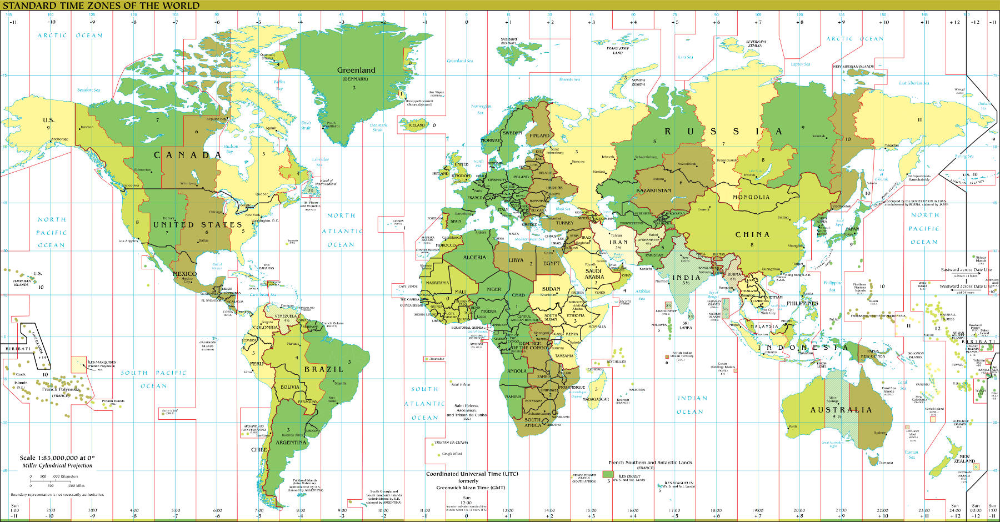
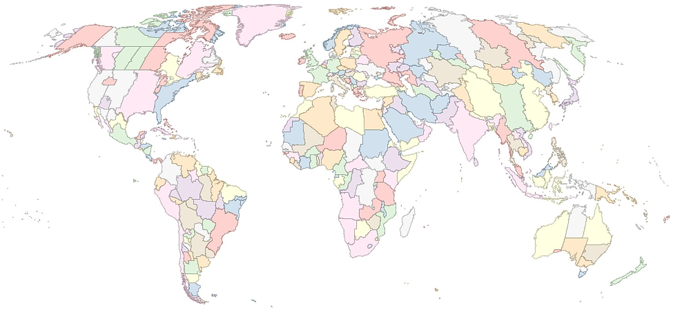
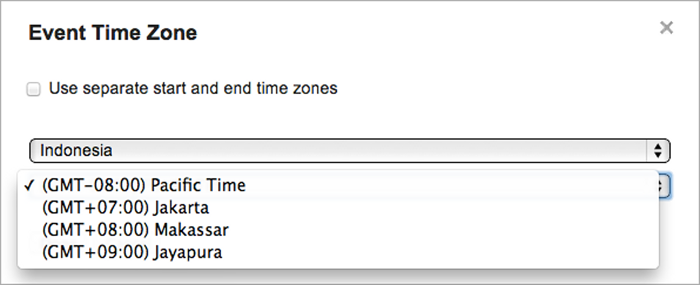

{#chapter-dates-and-times}
# Dates and Times

While we make use of time every day, we have likely been confused by it and asked questions like: When do I adjust my clocks for daylight saving time? What is the time difference between two cities? Is this year a leap year? While computers have eased the burden of some of these questions as users, we may have no choice but to confront these questions as programmers. And when manipulating dates and times in programs, we may have to confront not only with the aforementioned issues, but additional ones such as leap seconds, differing representations of time, robust methods for storing local time, and accurate methods for keeping time. In this chapter, we begin by developing an intuition for modeling time, and then explore practical aspects such as its standardized representations, best practices for managing it, and more.

## Time bases

*Coordinated Universal Time* has been the basis for time since 1972. To understand its definition and its idiosyncrasies, we must first understand the related time standards UT1 and TAI.

### Solar time and UT1

Since the Ancient Egyptians built obelisks over five-thousand years ago, we have equated the passage of time with the Sun's position in the sky. This reckoning of time is called *solar time*, and the time it takes for the Sun to return to its previous position in the sky is called a *solar day*. But the Earth's elliptical orbit and axial tilt causes the length of a solar day to vary throughout the year. Consequently a clock that ticks a constant number of times per day at a constant rate cannot keep solar time. To simplify timekeeping, from all solar days in a year we can compute the average length of a solar day. This hypothetical fixed-length day is called the *mean solar day*.

Because of Britain's maritime dominance, many nautical maps referenced Greenwich, London as their [Prime Meridian](http://en.wikipedia.org/wiki/Prime_Meridian). Thus its mean solar time was chosen for all clocks to synchronize against. This time was called *Greenwich Mean Time*, or GMT. Mean solar time was supposed to allow all clocks to tick a constant number of times and at a constant rate each day. But by the 1860s, astronomers had discovered that the length of the mean solar day was actually increasing. This was because the gravitational attraction between the moon and the ocean's water was redistributing a significant portion of the Earth's mass, thereby decreasing its rotational speed. Because scientists had defined the second as 1/86,400 of a mean solar day, the length of a second was also increasing.

In 1958 *UT1*, or *Universal Time 1*, succeeded GMT as the measure of mean solar time at the Prime Meridian. Astronomers derive its value from celestial points of reference that are more stable and more distant than the sun.

### TAI

In 1956 scientists standardized the [SI second](http://en.wikipedia.org/wiki/International_System_of_Units) as approximately 1/86,400 of a mean solar day in 1900, thereby redefining the second as a constant length of time. By 1972 atomic clocks measured SI seconds so precisely that they will neither gain nor lose such a second over millions of years.

*International Atomic Time*, abbreviated as TAI from its French name *Temps atomique international*, is a time standard that averages the time from over 200 atomic clocks worldwide. Because of its precision, TAI defines the rate at which all other clocks should tick. When TAI was synchronized with UT1 at the beginning of 1958, the Earth's rotational speed had slowed down since 1900. Consequently, the length of a mean solar day was greater than 86,400 SI seconds, and so TAI was already running faster than UT1. As of 2013, TAI is 35 seconds ahead of UT1.

### UTC and leap seconds

TAI uses the SI second to precisely define the rate at which clocks should tick. Unlike UT1, this measure of time is completely independent of solar time and the Earth's rotational speed. But timekeeping devices have always reflected solar time like UT1. The Gregorian calendar, too, is a *solar calendar*, meaning each date maps to an approximate position of the Earth while revolving around the Sun. To combine the convention of solar time, measured by UT1, with the precision of SI seconds, used by TAI, the time standard UTC was introduced in 1963. It is now the primary standard for time worldwide. Confusingly, GMT is now used as a synonym for UTC, even though UT1 succeeded it.

A> Unlike TAI, which is an acronym of its French name, UTC is not an acronym for anything. English speakers proposed the name *coordinated universal time*, or CUT. French speakers proposed the name *temps universel coordonné*, or TUC. So that everyone used the same abbreviation, UTC rearranges the letters to show no favoritism to either language.

UTC ticks SI seconds like TAI does. But it is an integer number of seconds offset from TAI, and is never more than 0.9 seconds apart from UT1. Whenever UTC and UT1 drift more than 0.6 seconds apart, the International Earth Rotation and Reference Systems Service, or IERS, schedules a *leap second*. This leap second modifies the last UTC minute of either June 30 or December 31:

* When the mean solar day of UT1 is greater than 86,400 seconds, then UT1 lags behind UTC. If the IERS *adds* a leap second, then the last UTC minute has 61 seconds. A UTC clock will show 23:59:60 instead of 23:59:59 on the last second of the day. This postpones the beginning of the next UTC day by one second, allowing UT1 to catch up to UTC.
* When the mean solar day of UT1 is less than 86,400 seconds, then UTC lags behind UT1. If the IERS *removes* a leap second, then the last UTC minute has 59 seconds. A UTC clock will show 23:59:58 instead of 23:59:59 on the last second of the day. This advances the beginning of the next UTC day by one second, allowing UTC to catch up to UT1.

After the leap second, UTC and UT1 are less than 0.4 seconds apart, while the offset between UTC and TAI has been changed by exactly one second. For example, consider the last leap second, added on June 30, 2012. Sampling every 0.5 seconds from 24-hour clocks:

|TAI                         |UTC                          |TAI--UTC (seconds) |
|----------------------------|-----------------------------|-------------------|
|00:00:33.00 on July 1, 2012 |23:59:59.00 on June 30, 2012 |34.00              |
|00:00:33:50 on July 1, 2012 |23:59:59.50 on June 30, 2012 |34.00              |
|00:00:34:00 on July 1, 2012 |23:59:60.00 on June 30, 2012 |34.00              |
|00:00:34.50 on July 1, 2012 |23:59:60.50 on June 30, 2012 |34.50              |
|00:00:35.00 on July 1, 2012 |00:00:00.00 on July 1, 2012  |35.00              |
|00:00:35.50 on July 1, 2012 |00:00:00.50 on July 1, 2012  |35.00              |
|00:00:36.00 on July 1, 2012 |00:00:01.00 on July 1, 2012  |35.00              |

[^iers]: http://maia.usno.navy.mil/

When leap seconds were introduced in 1972, UTC was 10 seconds behind TAI. Since then, the mean solar day been consistently longer than 86,400 SI seconds, and so the IERS has added 25 additional leap seconds. Consequently, UTC is now 35 seconds behind TAI. If the mean solar day were consistently shorter than than 86,400 SI seconds for some period of time, then the IERS would remove a leap second. This would ensure that that UT1 does not run more than 0.9 seconds ahead of UTC. But the IERS has never removed a leap second. Instead, the Earth's rotational speed continues to decrease. It's expected that sometime in the 22nd century, the IERS will add two leap seconds in one year.

The increasing frequency of leap seconds is problematic because leap seconds can introduce subtle bugs into low-level timing code. For example, the last leap second on June 30, 2012 caused downtime for the web sites of reddit, Mozilla, and Yelp. Therefore proposals have been made to abolish leap seconds, such as by replacing them with *leap hours*. But the scientific community won't make any decisions until at least 2015.

## Time zones

UTC approximates UT1, or the mean solar time at Greenwich, London. But other regions of the world prefer using clocks that approximate their own solar time. A region therefore sets all of its clocks to run ahead of UTC or behind UTC by a fixed number of seconds, called its *UTC offset*. Together these clocks adopt a *local time* within the region, and the region itself defines a *time zone*.

If an offset is ahead of UTC, we write it as UTC+[hh]:[mm] or UTC+[hh][mm]. Similarly, if an offset is behind UTC, we write it as UTC-[hh]:[mm] or UTC-[hh][mm]. For example, Venezuela uses an offset of UTC-04:30, and Nepal uses an offset of UTC+05:45. Offsets span between UTC-12:00, used by the [United States Minor Outlying Islands](http://en.wikipedia.org/wiki/United_States_Minor_Outlying_Islands), and UTC+14:00, used by the [Republic of Kiribati](http://en.wikipedia.org/wiki/Kiribati). If an offset is ahead of UTC by a whole number of hours, we can write it as simply UTC+[hh]. Similarly, if an offset is behind UTC by a whole number of hours, we can write it as simply UTC-[hh]. For example, New York uses Eastern Standard Time, which is 5 hours behind UTC and is written as UTC-05. California uses Pacific Standard Time, which is 8 hours behind UTC and is written as UTC-08.

[^cia_factbook]: https://www.cia.gov/library/publications/the-world-factbook/docs/refmaps.html

Conversationally, one time zone is *ahead* of another if its UTC offset is larger, and one time zone is *behind* another if its UTC offset is smaller. Because UTC has a *zero* offset, and "Zulu" is the NATO phonetic alphabet code word for Z, we also call UTC "Zulu time."

To convert a local time in one time zone to a local time in another time zone, use UTC as an intermediate representation. For example, California has an offset UTC-08:00, and so 01:00 in Los Angeles is equivalent to 09:00 UTC. This is equivalent to 14:50 in Sri Lanka, which has a UTC offset of UTC+05:30. If the time 00:00, or midnight, is between the two local times, then they belong to different days.

### Daylight saving time

Some regions of the world have more daylight during the summer than during the winter. If a region observes daylight saving time, then it moves its clocks forward one hour in the spring and backward one hour in the fall. This shifts the majority of the extra daylight to later in the day, thereby allowing residents to make use of it after work. UTC does not observe daylight saving time. Consequently, when a region begins observing daylight saving time, its UTC offset increases by one hour. Because each time zone has a fixed UTC offset, the region is no longer using the time zone for its *standard time*. Instead, it begins using the time zone for its daylight saving time.

In the United states, the transition to daylight saving time does not happen all at once. Instead, it happens at 2:00 a.m. in each time zone. The standard and daylight saving time zones for the 50 United States are:

| Standard time zone                          | Daylight saving time zone                  |
|---------------------------------------------|--------------------------------------------|
| Hawaii-Aleutian Standard Time (HST, UTC-10) | Hawaii-Aleutian Daylight Time (HDT, UTC-9) |
| Alaska Standard Time (AKST, UTC-9)          | Alaska Daylight Time (AKDT, UTC-8)         |
| Pacific Standard Time (PST, UTC-8)          | Pacific Daylight Time (PDT, UTC-7)         |
| Mountain Standard Time (MST, UTC-7)         | Mountain Daylight Time (MDT, UTC-6)        |
| Central Standard Time (CST, UTC-6)          | Central Daylight Time (CDT, UTC-5)         |
| Eastern Standard Time (EST, UTC-5)          | Eastern Daylight Time (EDT, UTC-4)         |

Hawaii only ever observed daylight saving time for three weeks at the start of May 1933, and so it does not currently shift to its eponymous Hawaii-Aleutian Daylight Time. The Aleutian Islands of Alaska, however, do switch between HST and HDT. Apart from the Western world, most countries choose not to observe daylight saving time.

Conversationally, when referring to the time zone of a region, we omit specifying either standard time or daylight saving time. For example, we say "Pacific time" instead of "Pacific standard time" or "Pacific daylight time." But such cavalier use of time zones in your code can lead to times being incorrectly offset by one hour. Code should therefore rely on the tz database, discussed next, to determine whether to observe or apply daylight saving time.

### tz database

The [tz database](http://cs.ucla.edu/~eggert/tz/), which is also called the "Olson database" after its first and longtime maintainer Arthur David Olson, is a comprehensive history of time zones, UTC offsets, and daylight saving rules adopted around the world since January 1, 1970. It defines a set of national regions, where all clocks in a given region have shared the same time since this date. Each region has a unique name, or *location*, formed by prefixing the largest city in the region with the continent or ocean it is found in. For example, location `America/New_York` refers to the region that shares its time with New York City and is on Eastern time. And location `America/Los_Angeles` refers to the region that shares its time with Los Angeles and is on Pacific time. The database records when the leap seconds in a region occurred, but it does not define the geographical boundaries of each region.

{#tz_world}

[^tz_world]: http://efele.net/maps/tz/world/

On a Unix or Linux system, the directory `/usr/share/zoneinfo/` contains a compiled form of the tz database, while `/etc/localtime` is a link that specifies the local time:

{lang=text}
~~~
mgp:~$ ls -l /etc/localtime 
lrwxr-xr-x  1 root  wheel  39 May 11  2012 /etc/localtime@ ->
    /usr/share/zoneinfo/America/Los_Angeles
~~~

Many libraries, such as the [pytz module](https://pypi.python.org/pypi/pytz/) for Python, provide programmatic access to the tz database. This lets us use the tz database to ensure that localized times obey daylight saving time whenever necessary. For example, the following program creates the time 16:30 UTC on dates January 10, 2013 and June 10, 2013. It then converts each time to Pacific time, represented by location `America/Los_Angeles`:

{lang=python}
~~~
from datetime import datetime
import pytz
from pytz import timezone

los_angeles_tz = timezone('America/Los_Angeles')
tz_fmt = '%H:%M %Z%z on %B %d, %Y'

# Create a UTC datetime when Pacific Daylight Saving Time is in effect.
utc_dt = datetime(2013, 1, 10, 16, 30, tzinfo=pytz.utc)
los_angeles_dt = utc_dt.astimezone(los_angeles_tz)
print 'using PST: %s' % los_angeles_dt.strftime(tz_fmt)
# Create a UTC datetime when Pacific Standard Time is in effect.
utc_dt = datetime(2013, 6, 10, 16, 30, tzinfo=pytz.utc)
los_angeles_dt = utc_dt.astimezone(los_angeles_tz)
print 'using PDT: %s' % los_angeles_dt.strftime(tz_fmt)
~~~

This code uses method `strftime` to convert both `datetime` objects to string with the format specified by `tz_fmt`. When run, this prints:

{lang=text}
~~~
using PST: 08:30 PST-0800 on January 10, 2013
using PDT: 09:30 PDT-0700 on June 10, 2013
~~~

January 10, 2013 is a day when Pacific time is on standard time, and so location `America/Los_Angeles` uses time zone Pacific Standard Time, or PST. Therefore the first line displays this date's local time as 08:30 with a UTC offset of -08:00. But June 10, 2013 is a day when Pacific time is on daylight saving time, and so location `America/Los_Angeles` uses time zone Pacific Daylight Time, or PDT. Therefore the second line displays this date's local time as 09:30 with a UTC offset of -07:00.

Location names exclude country names. Instead, they include a continent or ocean and the largest city in the region. This makes them resistant to [countries changing their names or capital cities](http://en.wikipedia.org/wiki/Timeline_of_country_and_capital_changes). (Note that `America` in `America/New_York` refers to [the Americas](http://en.wikipedia.org/wiki/Americas), and is also used in locations such as `America/Montreal` and `America/Argentina/Buenos_Aires`.) But the tz database does guarantee at least one location name for any [two-letter country code](http://en.wikipedia.org/wiki/ISO_3166-1_alpha-2) defined in the ISO 3166 standard. If a user must choose his or her time zone, it's common to have the user first choose a country, and then choose a location from the tz database. The user should not choose a time zone because it does not always specify whether daylight saving time is observed. For example, both Hawaii and the Aleutian Islands use Hawaii-Aleutian time, but only the latter observes daylight saving time. The tz database locations `Pacific/Honolulu` and `America/Adak` make this distinction.

For example, [Google Calendar](https://www.google.com/calendar/) shows the following locations for Indonesia:

These correspond to locations `Asia/Jakarta`, `Asia/Makassur`, and `Asia/Jayapura` in the tz database. (Pacific Time corresponds to my local time, and so Google Calendar displays it regardless of the chosen country. Also note that Google Calendar uses GMT a synonym of UTC.)

The pytz module defines a dictionary named `country_timezones` that maps two-letter country codes to their respective locations. The following program prints all location names for Indonesia, which has the country code `"ID"`:

{lang=python}
~~~
import pytz
time_zones = pytz.country_timezones["ID"]
print time_zones

def _get_time_zone_name(time_zone):
  """Return only the city names with spaces replacing underscores."""
  return time_zone.rsplit('/', 1)[1].replace('_', ' ')
print [_get_time_zone_name(time_zone) for time_zone in time_zones]
~~~

When run, this prints:

{lang=text}
~~~
[u'Asia/Jakarta', u'Asia/Pontianak', u'Asia/Makassar', u'Asia/Jayapura']
[u'Jakarta', u'Pontianak', u'Makassar', u'Jayapura']
~~~

Note that the tz database contains "Pontianak" as a location, but Google Calendar does not display this as an option. Looking at the data file `asia` in the tz database, we find the following rules for the region `Asia/Jakarta`:

{lang=text}
~~~
...
8:00  - WIT 1950 May
7:30  - WIT 1964
7:00  - WIT
~~~

This means that from May 1950 to 1964, the region containing Jakarta was on Western Indonesia Time (WIT), which had a UTC offset of +07:30. In 1964, the region kept on WIT, which changed its UTC offset to +07:00. The dash means that the region never observed daylight saving time.

Immediately below it, we find the following rules for `Asia/Pontianak`:

{lang=text}
~~~
...
7:30  - WIT 1964
8:00  - CIT 1988 Jan  1
7:00  - WIT
~~~

This means that from 1964 to 1988, the region containing Pontianak was on Central Indonesia Time (CIT), which had a UTC offset of +8:00. In 1988, the region switched to WIT, which had already changed its UTC offset to +07:00. Again, it never observed daylight saving time. Because the time of Pontianak has equaled that of Jakarta since 1988, Google preserves only the latter option.

Combining pytz with the [iso3166 module](https://pypi.python.org/pypi/iso3166), we can map each country name to its locations in the tz database:

{lang=python}
~~~
from iso3166 import countries
for country in countries:
  country_alpha2 = country.alpha2.upper()
  time_zones = pytz.country_timezones.get(country_alpha2, [])
  print '%s (%s): %s' % (country.name, country_alpha2, time_zones)
~~~

When run, this prints:

{lang=text}
~~~
Afghanistan (AF): [u'Asia/Kabul']
Aland Islands (AX): [u'Europe/Mariehamn']
Albania (AL): [u'Europe/Tirane']
...
Yemen (YE): [u'Asia/Aden']
Zambia (ZM): [u'Africa/Lusaka']
Zimbabwe (ZW): [u'Africa/Harare']
~~~

Like Indonesia, some locations belonging to the same country may now share the same time, but did not in the past. For example, China uses only one time zone. But looking at [Eric Muller's world map of the tz database regions](#tz_world), we can see that it used multiple time zones in the past. If the user must select a country and then a location, try to adopt an existing library or module that removes redundant locations. But if you cannot find one, the vast majority of countries have only one location anyway.

## ISO 8601

The ISO 8601 standard defines a text representation for dates and times using the Gregorian calendar. Dates have the form `YYYY-MM-DD`, and times have the 24-hour clock form `hh:mm:ss`. It permits removing the least significant values, so that `YYYY-MM` can represent a month in a year, and `YYYY` can represent just a year. Similarly, `hh:mm` can represent a minute in an hour, and `hh` can represent just an hour. The least significant value supports a decimal fraction. Typically a time uses this to specify the fraction of the second, such as `16:54:32.789`.

The standard also supports appending a UTC offset to a time value. This has the form `+hh:mm` or `-hh:mm`, or simply `+hh` or `-hh` if the offset is a whole number of hours. If the time is in UTC, then we can append `Z` instead of `+00:00` or `+00`. As mentioned earlier, we call this Zulu time. Finally, if both a date and time are specified, then the delimiter `T` joins their values.

Putting everything together, the following Python program creates a `datetime` instance with my local date and time in `America/Los_Angeles`, converts it to UTC, and then converts it to `Asia/Kathmandu` (UTC+5:45) and `Asia/Tokyo` (UTC+9:00). It calls the `isoformat()` method of each `datetime` instance to print its ISO value:

{lang=python}
~~~
from datetime import datetime
import pytz
from pytz import timezone

# Get the time zones for Los Angeles, Kathmandu, and Tokyo.
los_angeles_tz = timezone('America/Los_Angeles')
kathmandu_tz = timezone('Asia/Kathmandu')
tokyo_tz = timezone('Asia/Tokyo')

# Get the local time for Los Angeles.
now = datetime.now(los_angeles_tz)
# Print the ISO string for UTC and each time zone.
print 'America/Los_Angeles: %s' % now.isoformat()
print 'UTC: %s' % now.astimezone(pytz.utc).isoformat()
print 'Asia/Kathmandu: %s' % now.astimezone(kathmandu_tz).isoformat()
print 'Asia/Tokyo: %s' % now.astimezone(tokyo_tz).isoformat()
~~~

I ran this on June 4, `America/Los_Angeles` was on Pacific Daylight Time (UTC-07:00). It printed:

{lang=text}
~~~
America/Los_Angeles: 2013-06-04T15:46:17.751383-07:00
UTC: 2013-06-04T22:46:17.751383+00:00
Asia/Kathmandu: 2013-06-05T04:31:17.751383+05:45
Asia/Tokyo: 2013-06-05T07:46:17.751383+09:00
~~~

These representations are all equivalent. While pytz represented UTC using the offset `+00:00`, an equivalent representation is `2013-06-04T22:46:17.751383Z`.

Libraries exist in most programming languages to convert between ISO 8601 strings and native date and time objects. For example, using the Joda-Time library for Java:

{lang=java}
~~~
String isoString = "2013-06-04T15:54:13.375-07:00";
// Convert the string back to a DateTime object.
DateTimeFormatter formatter = ISODateTimeFormat.dateTime();
DateTime converted = formatter.parseDateTime(isoString);
System.out.println("converted: " + formatter.print(converted));
~~~

When run, this prints:

{lang=text}
~~~
converted: 2013-06-04T15:54:13.375-07:00
~~~

In these examples, my tz database location `America/Los_Angeles` specified my time zone on June 4 as PDT, which in turn specified my UTC offset as `07-00` in the ISO 8601 string. But many tz database locations can share a given UTC offset, and only some of those locations may observe daylight saving time. Therefore we cannot reconstruct the tz database location from an ISO 8601 string. Instead we must store the location separately.

W> A ISO 8601 string without a trailing `Z` or UTC offset is not portable across time zones. Always err on the side of caution and ensure that either one is present. If omitted, converting such a value to a native date and time object can yield unexpected behavior.

The standard also defines text representations for:

* The week of a year, starting at 1 and ending at 53. We can append to it the day of the week, starting on Monday at 1 and ending on Sunday at 7.
* The day of the year, also called the *ordinal date*, starting at 1 and ending at 366.
* A *duration*, which is a length of time with no start date or end date.
* A *time interval*, which is a length of time with a start date and an end date. If a start date and a duration is given, then the end date is implicit. If the end date and a duration is given, then the start date is implicit. If both the start date and end date are given, then the duration is implicit.

## Unix time

UTC represents time as a series of components, like hours, minutes, and seconds. The Unix and Linux operating systems, however, represent time as a single value called *Unix time*. This is defined as the number of seconds since the *Unix epoch*, which is January 1, 1970 at 00:00:00 UTC. We can print the current Unix time in a terminal using the `date` command:

{lang=text}
~~~
mgp:~$ date +%s
1370546854
~~~

While Unix time is defined as the number of seconds since the Unix epoch, methods in different programming languages return it with varying precision or units. For example:

* In C, method `time()` in `time.h` returns the seconds since the epoch as an integer, while method `gettimeofday()` in `sys/time.h` returns a `struct` that also contains the fractional number of microseconds for higher precision.
* In Java, static method `System.currentTimeMillis()` returns the number of milliseconds since the epoch as a 64-bit `long`. To convert this value to Unix time, you must divide by 1000.
* In Python, method `time()` of the `time` module returns the seconds since the epoch as a floating point value. Similarly, method `timeIntervalSince1970` of `NSDate` in Objective C returns the seconds since the epoch as a `NSTimeInterval`, which is a `typedef` of `double`. Its documentation says that this yields "sub-millisecond precision over a range of 10,000 years."

Unlike UTC, Unix time does not include leap seconds. Therefore between midnight one day and midnight the next day, Unix time increases by exactly 86,400 seconds. This invariant holds even if UTC adds or subtracts a leap second at the end of the day. So similar to how UTC is an approximation of UT1, Unix time is an encoding of UTC that is [lossy](http://en.wikipedia.org/wiki/Lossy_compression) around leap seconds. To calculate the true number of seconds between two Unix timestamps, we must consult a table containing all intervening leap seconds. This is very rarely done in practice, however. For example, the `difftime` method in `time.h` returns the number of seconds between two Unix timestamps by simple subtraction.

On most systems that also use NTP, described below, if UTC adds a leap second, then immediately after it begins the system decrements Unix time by one second. This erases the leap second from Unix time and maintains its invariant of 86,400 seconds between successive midnights. Consider the last leap second added on June 30, 2012. Sampling every 0.25 seconds:

|UTC (ISO 8601)           |Unix time       |
|-------------------------|----------------|
|`2012-07-01T00:59:59.00` |`1341100799.00` |
|`2012-07-01T00:59:59.25` |`1341100799.25` |
|`2012-06-30T23:59:59.50` |`1341100799.50` |
|`2012-06-30T23:59:59.75` |`1341100799.75` |
|`2012-06-30T23:59:60.00` |`1341100800.00` |
|`2012-06-30T23:59:60.25` |`1341100799.25` |
|`2012-06-30T23:59:60.50` |`1341100799.50` |
|`2012-06-30T23:59:60.75` |`1341100799.75` |
|`2012-07-01T00:00:00.00` |`1341100800.00` |

Similarly, if UTC removes a leap second, then immediately before midnight of the following day the system increments Unix time by one second. This preserves the leap second in Unix time and again maintains its invariant of 86,400 seconds between successive midnights. But as mentioned earlier, this has not happened yet.

Note that adding or removing a leap second makes the Unix timescale discontinuous, jumping to the next value 1 second away. Furthermore, because adding a leap second decrements Unix time by one second, there is no one-to-one mapping between UTC and Unix time values. For example, the Unix time `1341100799.75` above corresponds to UTC value `2012-06-30T23:59:59.75Z`, which happens before the leap second, as well as UTC value `2012-06-30T23:59:60.75Z`, which happens during the leap second. In such cases, converting from Unix time back to UTC always yields a time that is not part of any leap second. For example, consider the following Python program that converts Unix times around the leap second to ISO 8601 format:

{lang=python}
~~~
from datetime import datetime
for timestamp in (1341100799, 1341100799.50, 1341100800):
  print '%.2f = UTC %s' % (
      timestamp, datetime.utcfromtimestamp(timestamp).isoformat())
~~~

When run, this prints:

{lang=text}
~~~
1341100799.00 = UTC 2012-06-30T23:59:59
1341100799.50 = UTC 2012-06-30T23:59:59.500000
1341100800.00 = UTC 2012-07-01T00:00:00
~~~

Note that no UTC time containing `23:59:60` is displayed.

### Year 2038 problem

Programs written in C or C++ represent Unix time with type `time_t`, which is typically a 32-bit signed integer on 32-bit architectures. Because this type is signed, negative values represent times before the Unix epoch, where -1 represents `1969-12-31T23:59:59`, -2 represents `1969-12-31T23:59:58`, and so forth.

At the UTC date and time `2038-01-19T03:14:07`, such a variable will hold the Unix time value {$$}2^{31}-1{/$$}, or 2,147,483,647. This is the largest value that a 32-bit signed integer can hold. Consequently, it will overflow on the next second. Once this happens, it will hold the Unix time value {$$}-2^{31}{/$$}, or -2,147,483,648. This Unix time equals the UTC value `1901-12-13T20:45:52`. Because of its similarity to the [year 2000 problem](https://en.wikipedia.org/wiki/Year_2000_problem), this overflow condition is known as the *year 2038 problem*. Note that a 32-bit application can demonstrate this problem right now by referring to a date and time later than `2038-01-19T03:14:07`.

A> UTC was not defined until 1963. And until leap seconds were introduced in 1972, UTC was adjusted by fractions of a second to approximate UT1. Therefore Unix times before 1972 cannot precisely represent any time in UTC. Likely you will never reference dates so far in the past anyway. But if you do, the error of these approximations will likely be inconsequential.

Simply redefining `time_t` as a 64-bit value on 32-bit architectures would cause incompatibility with existing binary data. Consider the following C code:

{lang=c}
~~~
typedef struct {
  time_t start;
  time_t end;
} interval_t;

bool WriteInterval(FILE *file, interval_t *interval) {
  return fwrite(interval, sizeof(*interval), 1, file) == 1;
}
bool ReadInterval(FILE *file, interval_t *interval) {
  return fread(interval, sizeof(*interval), 1, file) == 1;
}
~~~

If `time_t` is 32 bits, then method `WriteInterval` writes 8 bytes to the given file. If we redefine `time_t` as a 64-bit signed integer and recompile the program, then method `ReadInterval` will fail because it attempts to read 16 bytes from the given file. , If the program is then recompiled so that `time_t` is 64 bits, calling `ReadInterval` attempts to read 16 bytes from `file`, and consequently fails. Reading and writing binary data like this is generally not portable anyway, due to factors such as [endianness](http://en.wikipedia.org/wiki/Endianness). But it is common in low-level or high-volume systems where speed and efficiency matter.

Programs compiled for 64-bit architectures represent integers, and hence `time_t`, as 64-bits. These programs are therefore not affected by the year 2038 problem. But similar to how software from the 1970s had to be changed before the year 2000, 32-bit architecture from the present day will have to be changed before the year 2038. This is especially relevant for software running on [embedded systems](http://en.wikipedia.org/wiki/Embedded_system). Such devices adopt simpler architectures and are not replaced as frequently as general purpose computing devices.

## Managing local times

Always represent times in UTC for as long as possible. When displaying a time as output, convert the UTC time to a local time at the latest convenient moment. When reading a time as input, convert the local time to a UTC time at the earliest convenient moment. This avoids errors from treating local times as UTC times, or from treating a local time as belonging to one time zone when it really belongs to another. Name a date and time variable so that you can tell whether it contains a local time or UTC.

The Python method `_get_utc_datetime` below accepts the components of a local time in a given time zone. It returns the corresponding `datetime` instance in UTC:

{lang=python}
~~~
from datetime import datetime
import pytz
from pytz import timezone

def _get_utc_datetime(timezone, year, month, day, hour, minute):
  time_local = timezone.localize(
      datetime(year, month, day, hour, minute))
  time_utc = time_local.astimezone(pytz.utc)
  return time_utc
~~~

The following code invokes this method with the date June 10, 2013 and time 09:30 at location `America/Los_Angeles`:

{lang=python}
~~~
los_angeles_tz = timezone('America/Los_Angeles')
time_local = {
   'year': 2013, 'month': 6, 'day': 10, 'hour': 9, 'minute': 30
}
time_utc = _get_utc_datetime(los_angeles_tz, **time_local)
print 'UTC datetime: %s' % time_utc.isoformat()
~~~

At this date and time, `America/Los_Angeles` uses the PDT time zone with the offset UTC-07. When this code runs, pytz converts 09:30 PDT to 16:30 UTC:

{lang=text}
~~~
UTC datetime: 2013-07-10T16:30:00+00:00
~~~

The `_get_local_datetime` method below performs the inverse of method `_get_utc_datetime`. It accepts a time zone and a `datetime` instance in UTC, and returns the components of its local time in that time zone:

{lang=python}
~~~
def _get_local_datetime(timezone, time_utc):
  time_local = time_utc.astimezone(timezone)
  # Deconstruct the local time into components for the client.
  time_local_components = {
    'year': time_local.year,
    'month': time_local.month, 'day': time_local.day,
    'hour': time_local.hour, 'minute': time_local.minute
  }
  return time_local_components
~~~

Changing the time zone instance associated with `time_utc` from UTC to `None` drops the `+00:00` suffix. If such a time were written to disk and then read back without a suffix, this could normally lead to ambiguity. But by establishing a convention that all times are UTC by default, we can avoid such ambiguity.

Now consider a Python web application that is similar to Google Calendar. When the user adds an event to his or her calendar, the following method `_add_event` runs on the server:

{lang=python}
~~~
def _add_event(request):
  # Convert from local times to UTC.
  user_time_zone = timezone(request.session['location'])
  start_time_local_params = request.params['start_time']
  end_time_local_params = request.params['end_time']
  start_time_utc = _get_utc_datetime(
      user_time_zone, **start_time_local_params)
  end_time_utc = _get_utc_datetime(
      user_time_zone, **end_time_local_params)

  # Create the new event in UTC.
  user_id = request.session['id']
  name = request.params['name']
  event_id = storage.add_event(
      user_id, name, start_time_utc, end_time_utc)
  return event_id
~~~

The request attribute `session` is a signed cookie, represented by a dictionary. Its `id` key maps to the user's unique identifier, and its `location` key maps to the user's tz database location. The request attribute `params` is the POST data from the user, also represented as a dictionary. Its `name` key maps to the event name. Its `start_time` and `end_time` keys both map to dictionaries. Both dictionaries contain the keys `year,` `month`, `day`, `hour`, and `minute`. These collections of components specify the start and end times of the event in the time zone of the user. The code calls method `_get_utc_datetime` to convert the start and end time components to `datetime` objects in UTC. It then passes these UTC `datetime` objects to method `add_event` of storage. The storage element likely converts the `datetime` objects to Unix timestamps, and then persists those timestamps to the database.

When the user views the details about an event on his or her calendar, the following method `_get_event` runs on the server:

{lang=python}
~~~
def get_event(request):
  # Get this event and convert its UTC times to local times.
  user_id = request.session['user_id']
  event_id = request.params['event_id']
  event = storage.get_event(user_id, event_id)
  if not event:
    return {'error': 'missing_event'}

  user_time_zone = timezone(request.session['time_zone'])
  start_time_local_components = _get_local_datetime(
      user_time_zone, event.start_time_utc)
  end_time_local_components = _get_local_datetime(
      user_time_zone, event.end_time_utc)

  event_json = {}
  event_json['event'] = {
    'name': event.name,
    'start_time': start_time_local_components,
    'end_time': end_time_local_components
  }
  return event_json
~~~

Method `_get_local_datetime` performs the inverse of `_get_utc_datetime`: Instead of constructing a local date and time from individual components before converting that to UTC, it converts from UTC to a local date and time before deconstructing that into individual components.

As suggested, the application stores time in UTC. When necessary for display purposes, it applies the offset belonging to the user's tz database location, thereby converting a time in UTC to the user's local time.

## Network Time Protocol

Accurate clocks on all devices are crucial if shared date and time values are to have any meaning. The [Network Time Protocol](http://www.ntp.org/), or NTP, allows a client to synchronize its clock with that of a remote server. As explained below, it also accounts for latency from propagating the request and the response.

The daemon *ntpd* for Unix and Linux continuously sends NTP requests to synchronize time with publicly accessible time servers. On a server running [CentOS](http://www.centos.org/), we can use its script in `/etc/init.d/` to ensure that it is running:

{lang=text}
~~~
[mgp:~]$ sudo /etc/init.d/ntpd status
ntpd (pid  1119) is running...
~~~

To ensure that ntpd is running on your machine, check the documentation for your distribution or operating system.

The response to an NTP request contains time values in UTC. Each value is 64 bits, where 32 bits represent the second, and the remaining 32 bits represent the fraction of a second. The former causes the second value to overflow after 136 years. Because this second value started counting from January 1, 1900, this overflow happens in 2036, but NTP Version 4 supports the concept of an era to avoid problems reminiscent of Y2K. The latter allows for theoretical accuracy up to {$$}10^{-10}{/$$} seconds, but the variability of latency over a network as well as operating system scheduling restricts its accuracy to tens of milliseconds on the Internet and less than a millisecond on a LAN.

A> Although you will probably never need to know it works, the NTP protocol is quite elegant in its simplicity. The client sends a request to the server when its clock reads {$$}t_0{/$$}. The server receives the request when its clock reads {$$}t_1{/$$}, and sends a response when its clock reads {$$}t_2{/$$}. The response to the client includes values {$$}t_1{/$$} and {$$}t_2{/$$}, both of which are "correct" time values. The client receives this response when its clock reads {$$}t_3{/$$}.
A>
A> The server therefore spends {$$}t_2 - t_1{/$$} seconds processing the request, and the client spends {$$}t_3 - t_0{/$$} seconds waiting for the response. Subtracting the time processing the request, the client calculates the total time to propagate both the request and the response as {$$}[(t_3 - t_0) - (t_2 - t_1)]{/$$} seconds. Assuming that the latency in both directions is equal, it therefore takes {$$}[(t_3 - t_0) - (t_2 - t_1)]/2{/$$} seconds for the response to propagate to the client.
A>
A> If the correct time is {$$}t_2{/$$} when the server sends the response, then the correct time when the response reaches the client is {$$}t_2 + [(t_3 - t_0) - (t_2 - t_1)]/2{/$$}. The client, however, receives the response when its own clock reads {$$}t_3{/$$}. If these values are not equal, it is because the client clock is incorrect; assuming the server is ahead by {$$}\theta{/$$} seconds, we have {$$}t_3 + \theta = t_2 + [(t_3 - t_0) - (t_2 - t_1)]/2{/$$}. Solving for {$$}\theta{/$$}, we get {$$}\theta = [(t_1 - t_0) + (t_2 - t_3)]/2{/$$}. The client can set its clock to the correct time by advancing it this number of seconds.

The header of the NTP response also contains a two-bit integer value that encodes whether a leap second is to be added or removed at the end of the current month. If a second is to be added, then on the start of the last day of the month, the [high accuracy clock](http://www.gnu.org/software/libc/manual/html_node/High-Accuracy-Clock.html) in the Unix or Linux kernel is armed so that it adds one second at the end of the day. When the leap second begins, it does this by decrementing one second from the system clock. Time conversion routines in the kernel recognize this condition and display the leap second number as 60. But during this time, the kernel methods to read the clock value exhibit special behavior since it could be very problematic for applications to observe time suddenly jumping backward by one second: Each time value read is still larger than the last, but from a dilated timescale that is like reading from a slowed clock. Normal behavior resumes when the system clock, which was set back one second, catches up to its value.

For example, if the observed Unix time increased by 0.01 seconds for every 0.25 seconds of the leap second added on June 30, 2012:

|UTC (ISO 8601)           |Unix time (internal) |Unix time (observed) |
|-------------------------|---------------------|---------------------|
|`2012-06-30T23:59:59.50` |`1341100799.50`      |`1341100799.50`      |
|`2012-06-30T23:59:59.75` |`1341100799.75`      |`1341100799.75`      |
|`2012-06-30T23:59:60.00` |`1341100800.00`      |`1341100800.00`      |
|`2012-06-30T23:59:60.25` |`1341100799.25`      |`1341100800.01`      |
|`2012-06-30T23:59:60.50` |`1341100799.50`      |`1341100800.02`      |
|`2012-06-30T23:59:60.75` |`1341100799.75`      |`1341100800.03`      |
|`2012-07-01T00:00:00.00` |`1341100800.00`      |`1341100800.04`      |
|`2012-07-01T00:00:00.25` |`1341100800.25`      |`1341100800.25`      |
|`2012-07-01T00:00:00.50` |`1341100800.50`      |`1341100800.50`      |

Note that this behavior does not comply with the POSIX standard, but between 1988 and 2001 this standard also defined Unix time such that the year 2100 was wrongfully considered a leap year. And so the developers knew not to value compliance above all else.

A> Google [extended this technique](http://googleblog.blogspot.com/2011/09/time-technology-and-leaping-seconds.html) by modifying its NTP servers so that they never encode a leap second in the NTP response header. Instead, the NTP servers contract the 24 hours preceding a leap second by 1 second, and so any client synchronizing its time with them using `ntpd` does the same. This "leap smear" makes it unnecessary for a client to subtract 1 second from its Unix time when the leap second starts, as described above.

## Summary

This chapter explored the measurement and management of dates and times. Some key takeaways include:

* Solar time, or UT1, is the passage of time that is governed by the sun's position in the sky.
* UTC approximates solar time. It ticks at a constant rate of SI seconds, and leap seconds make small adjustments.
* A time zone is a region where all clocks adopt a local time, or run ahead or behind UTC by some fixed offset.
* Some regions switch from standard time to daylight saving time, thereby shifting extra sunlight to later in the day.
* The tz database defines the UTC offsets, daylight saving rules, and leap second applications for all time zones.
* ISO 8601 is the standard textual representation for dates and times paired with a UTC offset.
* The Unix epoch is the date January 1, 1970 at 00:00:00 UTC.
* Convert between UTC and the user's local time by applying an UTC offset from a tz database location.
* Always store time in Unix time or UTC format, and convert to local time as late as possible.
* The Network Time Protocol, or NTP, synchronizes a client's clock with that of a remote server.

